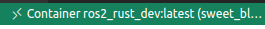

# ROS2 Rust workshop using Docker

1. Install the [Docker extension in VSCode](https://code.visualstudio.com/docs/containers/overview).
2. Open a terminal and clone the current repository
 
```bash
    cd ~
    git clone git@github.com:roboticswithjulia/ros2_rust_workshop.git
```
3. Go to the repository and run the following lines:

```bash
    cd ~/ros2_rust_workshop
    xhost + local:root
    code .
```

4. Open a terminal in the vscode: `Terminal -> New terminal`
5. Generate the images and run the container.

```bash
    cd ~/ros2_rust_workshop/docker
    ./build_image.sh
    ./run_user.sh
```
Note: It will download a lot of things, it may take a while in a slow connection. It took about 3min in my moderate machine with 100mb internet connection.

6. Open the docker container using the **docker** vscode extension. Double click in the following icon:    
   
    
7. Right button to the container **ros2_rust_dev:latest** -> **Attach Visual Studio Code**. A new vscode IDE will be opened, it is important to close the old one. 
8. If the following image appears, select Open Workspace and search for `/home/cuser/ros2_rust_workshop/`
   


9. It is important to work in the vscode IDE where the container is running, it is indicated in the bottom left part of the IDE in green:

  


10. You can open a terminal  `'+'` (Select Bash if it is not previously selected). 

The terminal will be inside of docker, and you'll see you are user `cuser@your-machine`.

Everything you do will be saved in the folder of the project (`your_path/ros2_rust_workshop`) (but owned by the container user). You won't lose progress. If things break, remove from `ros_ws` : `build`, `install`, `log`. If it goes really bad, remove what is inside of `src` and start over.


# Build inside docker

Build the workspace, about 3min30s in my moderate machine.

```bash
cd ~/ros2_rust_workshop/ros_ws
sudo apt-get update
rosdep update
rosdep install --from-paths src --ignore-src -r -y
source /opt/ros/humble/setup.sh
colcon build
```

# Run

```bash
source install/setup.bash
ros2 launch champ_config gazebo.launch.py
```

<p style="text-align: center">
  
</p>