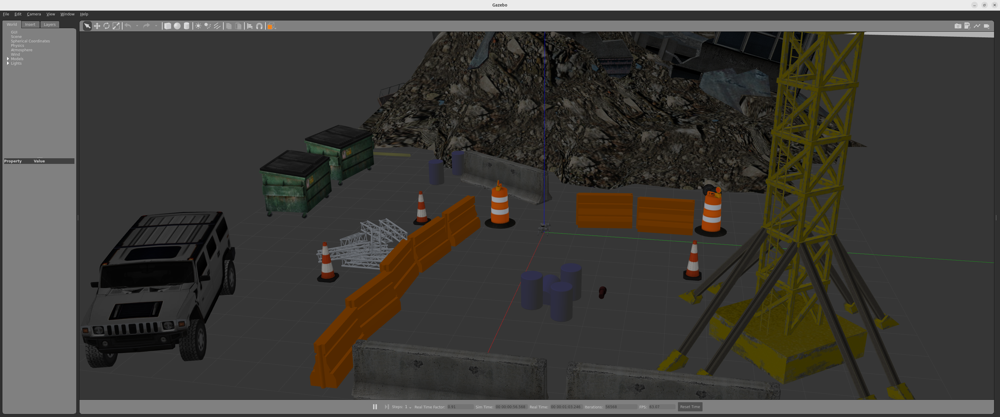

# ROS2 Rust Workshop: Developing Real Robotics Applications with ROS2 and Rust

<p style="text-align: center">
  
</p>

Rust is a language that allows creating efficient, high-quality software.

ROS2, the robotics operating system framework, now offers the possibility to be used with Rust. With this project, you'll learn how to develop nodes in Rust for your real robotics applications.

In this workshop, you'll learn the following:

* [1. What is / Why Rust?](#whatisrust)
* [2. How to install Rust with ROS2](#howtoinstallrust)
* [3. Run the simulation](#setupworkspace)
* [4. How to move a robot with ROS2 and Rust](#movearobotwithROS2)
* [4.1 How to create a ROS package in Rust](#createarustrospackage)
* [4.2 Basic Rust programming tips](#basicrustprogrammingtips)
* [4.3 How to create a subscriber in Rust](#howtocreateasubscribertoscantopicinrust)
* [4.4 How to create a publisher in Rust](#howtocreateapublishertocmdvelinrust)
* [4.5 How to create a subscriber and publisher in the same node](#howtocreatasubandpub)
* [5. Future work](#futurework)

## <a name="whatisrust"></a> 1. What is / Why Rust?

Rust is a systems programming language designed to optimize performance, security, and concurrency. It was originally developed by Mozilla and is now maintained by the Rust Foundation, which includes open-source components.

<div align="center">
    
</div>

Here are some key features and aspects of Rust:

<div align="center">
    
</div>

## <a name="howtoinstallrust"></a> 2. How to Install Rust with ROS2

ROS2 packages cannot be located by default within Rust packages. The only way to work with it currently is to install it from source or using Docker. These resources can be found here:
https://github.com/ros2-rust/ros2_rust.

## <a name="setupworkspace"></a> 3. Run the Simulation

1. Run the simulation in _Gazebo_ in `Terminal 1`
   >It might take a while the first time it opens, wait for the simulation to open and proceed with `Ctrl+C` and run it again

```bash
$ cd ~/ros2_rust_workshop/ros_ws
$ . install/setup.sh
$ ros2 launch go2_config gazebo_velodyne.launch.py world:=$(ros2 pkg prefix go2_config)/share/go2_config/worlds/outdoor.world
```

<div align="center">
    
</div>


2. See what *topics* are available in `Terminal 2`

```bash
$ cd ~/ros2_rust_workshop/ros_ws
$ source /opt/ros/humble/setup.sh 
$ . install/setup.sh 
$ ros2 topic list

/base_to_footprint_pose
/body_pose
/clicked_point
/clock
/cmd_vel
/diagnostics
/dynamic_joint_states
/foot
/foot_contacts
/goal_pose
/hokuyo_frame/scan
/imu/data
/initialpose
/joint_group_effort_controller/controller_state
/joint_group_effort_controller/joint_trajectory
/joint_group_effort_controller/state
/joint_group_effort_controller/transition_event
/joint_states
/joint_states_controller/transition_event
/odom
/odom/ground_truth
/odom/local
/odom/raw
/parameter_events
/performance_metrics
/robot_description
/rosout
/set_pose
/tf
/tf_static
/velodyne_points
```

## <a name="movearobotwithROS2"></a> 4. How to Move a Robot with ROS2 and Rust

### <a name="createarustrospackage"></a> 4.1 How to Create a ROS Package in Rust

**Cargo** is the package manager and build tool for Rust. It facilitates dependency management, project building, and testing. Through Cargo, you can compile your code, download and update third-party packages (called _"crates"_), and manage your project configurations.

**Crates** is the name used to refer to Rust packages. A _crate_ is a distributable unit of code that can be a library or an executable. Crates are managed through Cargo, Rust's package manager, which facilitates their publication, installation, and updating. You can find currently available _crates_ on the [Crates.io website](https://crates.io/).

There are two main types of crates:

- **Library crates**: Contain code that can be used by other crates. They don't have a main entry point.
- **Binary crates**: Contain a main entry point (main) that can be run as a standalone program.

Crates are defined in the *Cargo.toml* file, where their dependencies and configurations are specified.

<div align="center">
    
</div>


#### To create a new package:

```bash
$ cargo new <pkg_name>
```

Execute in `terminal #2`:
```bash
$ cd ~/ros2_rust_workshop/ros_ws/src
$ cargo new rust_apps
```

Each Cargo package in ROS2 will have the following file and folder structure:

- `src` folder: Contains source files (Rust, CPP, Python).
- `Cargo.toml`: File where you can define dependencies (_crates_), metadata, and some compiler configurations.
- `Cargo.lock`: Contains exact information about your dependencies. It is maintained by Cargo and should not be edited manually.

These are essential, so remember the following:

- Every ROS2 program you want to run is organized in a package.
- Every ROS2 program you create must be organized in a package.
- Packages are the main organization system for ROS2 programs.

Execute in  `Terminal #2`:
```bash
$ cd ~/ros2_rust_workshop/ros_ws/src/rust_apps
$ tree -c
.
|-- Cargo.toml
`-- src
    `-- main.rs

1 directory, 2 files
```

For ROS to recognize that this is a ROS package, it's necessary to add a **package.xml** file. This file contains metadata information about the package, such as its name, version, author, and necessary dependencies.

To create a **package.xml** file inside the _rust_apps_ directory and copy the provided code, follow these steps:

Editor: `rust_apps/package.xml`
```xml
<package format="3">
  <name>rust_apps</name>
  <version>0.0.0</version>
  <description>ROS2 Rust main package</description>
  <maintainer email="user@gmail.com">user</maintainer>
  <license>MIT</license>

  <depend>rclrs</depend>

  <export>
    <build_type>ament_cargo</build_type>
  </export>
</package>
```

The main Rust shortcuts:

- `cargo build`
- `cargo run`
- `cargo install <name of the package>`

> We won't use these commands at all since we're using ROS2, so we'll use ROS2 commands instead.

For large projects, you might not want to compile all packages immediately. Instead, you can follow these approaches:

Execute in `Terminal #2`:
```bash
cd ~/ros2_rust_workshop/ros_ws
colcon build --packages-select rust_apps
source install/setup.sh
```

Now we have the *crate* (ROS2 package) ready to implement a ROS2 node using Rust.

### <a name="basicrustprogrammingtips"></a> 4.2 Basic Rust Programming Tips

#### 4.2.1 Functions

```rust
fn <function_name>(variable:type){} -> <return_type>
```

```rust
fn main() -> Result<(), Error> {}
```

#### 4.2.2 Mutability

To create a new variable and assign it a value, use **let**. If the variable is mutable (meaning its value can change), use **mut**.

```rust
let mut message = std_msgs::msg::String::default();
```

#### 4.2.3 Steps to Create a ROS2 Node in Rust

##### 4.2.3.1 Create the context, shared state between nodes and similar entities.

```rust
let context = rclrs::Context::new(env::args())?;
```

##### 4.2.3.2 Create the node.

```rust
pub fn create_node(
    context: &Context,
    node_name: &str
) -> Result<Arc<Node>, RclrsError>
```

```rust
let node = rclrs::create_node(&context, "<node_name>")?;
```

##### 4.2.3.3 Create a subscriber.

```rust
source
pub fn create_subscription<T, Args>(
    &self,
    topic: &str,
    qos: QoSProfile,
    callback: impl SubscriptionCallback<T, Args>
) -> Result<Arc<Subscription<T>>, RclrsError>
where
    T: Message,
```

```rust
let _subscription = node.create_subscription::<sensor_msgs::msg::LaserScan, _>(
    "scan",
    rclrs::QOS_PROFILE_DEFAULT,
    move |msg: sensor_msgs::msg::LaserScan| {
        println!("Angle min: '{}'", msg.angle_min);
    },
)?;
```

##### 4.2.3.4 Create a publisher.

```rust
pub fn create_publisher<T>(
    &self,
    topic: &str,
    qos: QoSProfile
) -> Result<Arc<Publisher<T>>, RclrsError>
where
    T: Message,
```

```rust
let publisher = node.create_publisher::<Twist>("cmd_vel", rclrs::QOS_PROFILE_DEFAULT)?;
publisher.publish(&cmd_vel_message)?;
```

##### 4.2.3.5 What QoSProfile (Quality of Service Profile) do we have implemented?

- QOS_PROFILE_CLOCK
- QOS_PROFILE_DEFAULT
- QOS_PROFILE_PARAMETERS
- QOS_PROFILE_PARAMETER_EVENTS
- QOS_PROFILE_SENSOR_DATA
- QOS_PROFILE_SERVICES_DEFAULT
- QOS_PROFILE_SYSTEM_DEFAULT

Since the topic of QoS (Quality of Service) is complex and outside the scope of the current learning session, we'll use the default QoS profile, QOS_PROFILE_DEFAULT. If you want to learn more about QoS and how to customize it for your specific needs, I recommend checking the official ROS2 page [QoS](https://docs.ros.org/en/rolling/Concepts/Intermediate/About-Quality-of-Service-Settings.html).

##### 4.2.3.6 ROS spin - use outside a loop.

```rust
pub fn spin(node: Arc<Node>) -> Result<(), RclrsError>
```

```rust
rclrs::spin(node).map_err(|err| err.into())
```

##### 4.2.3.7 ROS spin_once - use inside a loop.

```rust
pub fn spin_once(
    node: Arc<Node>,
    timeout: Option<Duration>
) -> Result<(), RclrsError>
```

```rust
rclrs::spin_once(node.clone(), Some(std::time::Duration::from_millis(500)));
```

#### 4.2.4 Creating and Using Structures and Methods

```rust
struct Rectangle {
    width: u32,
    height: u32,
}

impl Rectangle {
    fn area(&self) -> u32 {
        self.width * self.height
    }
}

```

### <a name="howtocreateasubscribertoscantopicinrust"></a> 4.3 How to Create a Subscriber

#### 4.3.1 Study the Message Contained in the Topic

Let's see how to create a subscriber to the `/scan` topic using Rust.

1. First, let's subscribe to the topic to see what it contains.

Execute in `Terminal #2`:
```bash
$ source /opt/ros/humble/setup.sh
$ ros2 topic echo /velodyne_points

header:
  stamp:
    sec: 287
    nanosec: 12000000
  frame_id: velodyne
height: 1
width: 5546
fields:
- name: x
  offset: 0
  datatype: 7
  count: 1
- name: y
  offset: 4
  datatype: 7
  count: 1
- name: z
  offset: 8
  datatype: 7
  count: 1
- name: intensity
  offset: 12
  datatype: 7
  count: 1
- name: ring
  offset: 16
  datatype: 4
  count: 1
- name: time
  offset: 18
  datatype: 7
  count: 1
is_bigendian: false
point_step: 22
row_step: 122012
data:
- 100
- 123
- 51
- 192
- 23
...
```

2. To create a subscriber using Rust, we need to know what type of message and attributes the `/velodyne_points` topic contains.

Execute in `Terminal #2`:
```bash
$ ros2 topic info /velodyne_points

Type: sensor_msgs/msg/PointCloud2
Publisher count: 1
Subscription count: 0
```

Execute in Terminal #2:
```bash
$ ros2 interface show sensor_msgs/msg/PointCloud2

# Time of sensor data acquisition, and the coordinate frame ID (for 3d points).
std_msgs/Header header
        builtin_interfaces/Time stamp
                int32 sec
                uint32 nanosec
        string frame_id

# 2D structure of the point cloud. If the cloud is unordered, height is
# 1 and width is the length of the point cloud.
uint32 height
uint32 width

# Describes the channels and their layout in the binary data blob.
PointField[] fields
        uint8 INT8    = 1
        uint8 UINT8   = 2
        uint8 INT16   = 3
        uint8 UINT16  = 4
        uint8 INT32   = 5
        uint8 UINT32  = 6
        uint8 FLOAT32 = 7
        uint8 FLOAT64 = 8
        string name      #
        uint32 offset    #
        uint8  datatype  #
        uint32 count     #

bool    is_bigendian # Is this data bigendian?
uint32  point_step   # Length of a point in bytes
uint32  row_step     # Length of a row in bytes
uint8[] data         # Actual point data, size is (row_step*height)

bool is_dense        # True if there are no invalid points

```

#### 4.3.2 Code Implementation

1. Change the file name `main.rs -> scan_subscriber.rs`.

2. Execute in `Terminal #2`:
```bash
$ cd ~/ros2_rust_workshop/ros_ws/src/rust_apps/src
$ mv main.rs scan_subscriber.rs
```


3. Open in code editor `rust_apps/src/scan_subscriber.rs`

```bash
use std::env;
use anyhow::{Error, Result};

use sensor_msgs::msg::PointCloud2;
use std::convert::TryInto;

fn main() -> Result<(), Error> {
    let context = rclrs::Context::new(env::args())?;

    let node = rclrs::create_node(&context, "scan_subscriber")?;

    let mut _num_messages: usize = 0;

    let _subscription = node.create_subscription::<sensor_msgs::msg::PointCloud2, _>(
        "velodyne_points",
        rclrs::QOS_PROFILE_DEFAULT,
        move |msg: sensor_msgs::msg::PointCloud2| {
            let orientations = extract_orientation_from_pointcloud(&msg);

            for (i, (azimuth, elevation)) in orientations.iter().enumerate() {
                println!(
                    "Point {}: Azimuth = {:.3} rad, Elevation = {:.3} rad",
                    i + 1,
                    azimuth,
                    elevation
                );
            }
            
        },
    )?;

    rclrs::spin(node).map_err(|err| err.into())
}

fn extract_orientation_from_pointcloud(msg: &PointCloud2) -> Vec<(f32, f32)> {
    let mut orientations = Vec::new();

    let point_step = msg.point_step as usize; // Bytes per point
    if msg.data.is_empty() {
        eprintln!("PointCloud2 data buffer is empty!");
        return orientations;
    }

    for point in msg.data.chunks(point_step) {
        // Extract x, y, z fields (offsets 0, 4, 8 respectively)
        let x = f32::from_le_bytes(point[0..4].try_into().unwrap());
        let y = f32::from_le_bytes(point[4..8].try_into().unwrap());
        let z = f32::from_le_bytes(point[8..12].try_into().unwrap());

        // Calculate azimuth (theta) and elevation (phi)
        let azimuth = y.atan2(x); // Angle in radians
        let distance = (x * x + y * y + z * z).sqrt();
        let elevation = (z / distance).asin();

        // Store the orientation as (azimuth, elevation)
        orientations.push((azimuth, elevation));
    }

    orientations
}


```
4. Add ROS2 dependencies manually: Add **sensor_msgs** in the **package.xml** file.

Editor: `rust_apps/package.xml`
```xml
  <depend>sensor_msgs</depend>  
```

5. Add dependencies with other _crates_ and link the file with the ROS2 node in `/ros2_rust_ws/src/rust_apps/cargo.toml`.

Editor: `rust_apps/cargo.toml`

```toml
[dependencies.sensor_msgs]
sensor_msgs = "*"

[[bin]]
name = "scan_subscriber_node"
path = "src/scan_subscriber.rs"
```

6. Add dependencies `automatically`:

Execute in `Terminal #2`:
```bash
$ cd ~/ros2_rust_workshop/ros_ws/src/rust_apps
$ cargo add anyhow
$ cargo add rclrs
```

7. Build the node:

Execute in `Terminal #2`:
```bash
$ cd ~/ros2_rust_workshop/ros_ws
$ colcon build --packages-select rust_apps
```

#### 4.3.3 Code Execution

Execute in Terminal #2:
```bash
$ cd ~/ros2_rust_workshop/ros_ws
$ source install/setup.sh
$ ros2 run rust_apps scan_subscriber_node
```

Output:
```
Point 3656: Azimuth = 0.980 rad, Elevation = 0.052 rad
Point 3657: Azimuth = 0.980 rad, Elevation = 0.157 rad
Point 3658: Azimuth = 0.980 rad, Elevation = 0.192 rad
Point 3659: Azimuth = 0.995 rad, Elevation = -0.262 rad
Point 3660: Azimuth = 0.995 rad, Elevation = -0.227 rad
Point 3661: Azimuth = 0.995 rad, Elevation = -0.192 rad
Point 3662: Azimuth = 0.995 rad, Elevation = -0.157 rad
Point 3663: Azimuth = 0.995 rad, Elevation = -0.122 rad
Point 3664: Azimuth = 0.995 rad, Elevation = -0.087 rad
Point 3665: Azimuth = 0.995 rad, Elevation = -0.052 rad
Point 3666: Azimuth = 0.995 rad, Elevation = -0.017 rad
Point 3667: Azimuth = 0.995 rad, Elevation = 0.017 rad
Point 3668: Azimuth = 0.995 rad, Elevation = 0.122 rad
Point 3669: Azimuth = 0.995 rad, Elevation = 0.192 rad
Point 3670: Azimuth = 1.009 rad, Elevation = -0.262 rad
Point 3671: Azimuth = 1.009 rad, Elevation = -0.227 rad
Point 3672: Azimuth = 1.009 rad, Elevation = -0.192 rad
Point 3673: Azimuth = 1.009 rad, Elevation = -0.157 rad
Point 3674: Azimuth = 1.009 rad, Elevation = -0.122 rad
```

### <a name="howtocreateapublishertocmdvelinrust"></a> 4.4 How to Create a cmd_vel Publisher in Rust

#### 4.4.1 Code Implementation

1. Create a new file inside the Rust package *rust_apps* named *cmd_vel_publisher.rs* and paste the following code:

Editor: `rust_apps/src/cmd_vel_publisher.rs`
```rust
use std::env;
use anyhow::{Error, Result};
use geometry_msgs::msg::Twist as Twist;

fn main() -> Result<(), Error> {
    let context = rclrs::Context::new(env::args())?;

    let node = rclrs::create_node(&context, "cmd_vel_publisher")?; 

    let publisher = node.create_publisher::<Twist>("cmd_vel", rclrs::QOS_PROFILE_DEFAULT)?;

    let mut cmd_vel_message = Twist::default();

    let mut velocity = 1.0;
    let velocity_threshold = 1.0;
    let velocity_decrease = 0.05;

    while context.ok() {
        cmd_vel_message.linear.x = velocity;
        cmd_vel_message.linear.y = velocity;
        cmd_vel_message.angular.z = 0.0;
        if velocity < velocity_threshold*(-1.0) {velocity = velocity_threshold}
        else {velocity-=velocity_decrease};
        println!("Moving velocity lineal x: {:.2} and angular z: {:.2} m/s.",cmd_vel_message.linear.x , cmd_vel_message.angular.z);
        publisher.publish(&cmd_vel_message)?;
        std::thread::sleep(std::time::Duration::from_millis(500));
    }
    Ok(())
}
```

2. Add the *geometry_msgs* dependency and add the new node called *cmd_vel_publisher* inside *Cargo.toml*:

Editor: `rust_apps/Cargo.toml`
```toml
[dependencies.geometry_msgs]
geometry_msgs = "*"

[[bin]]
name = "cmd_vel_publisher_node"
path = "src/cmd_vel_publisher.rs"
```

Editor: `rust_apps/package.xml`
```xml
<depend>geometry_msgs</depend>  
```

3. Build the ROS2 package:

Execute in `Terminal #2`:
```bash
$ cd ~/ros2_rust_workshop/ros_ws
$ colcon build --packages-select rust_apps
```

#### 4.4.2 Code Execution

Execute in `Terminal #2`:
```bash
$ cd ~/ros2_rust_workshop/ros_ws
$ source install/setup.sh
```
4. Open the gazebo window and look through the robog go2 and execute the node `cmd_vel_publisher`.

Execute in `Terminal #2`:
```
$ source /opt/ros/humble/setup.sh 
$ ros2 run rust_apps cmd_vel_publisher_node
```


To stop the robot, you can terminate the program with `Ctrl+C` and then run the following command:

```bash
$ ros2 topic pub --once /cmd_vel geometry_msgs/msg/Twist '{linear: {x: 0.0, y: 0.0, z: 0.0}, angular: {x: 0.0, y: 0.0, z: 0.0}}'
```

### <a name="howtocreatasubandpub"></a> 4.5 How to Create a Subscriber and Publisher in the Same Node

#### 4.5.1 Code Implementation

1. Real projects go beyond simple publish and subscribe models. Let's collaborate to create a Rust structure that includes both a publisher and a subscriber. This structure will allow the robot to navigate autonomously through the simulation environment, avoiding collisions independently.

Code editor: `rust_apps/src/obstacle_avoidance.rs`

``` bash
use std::{
    env,
    sync::{
        Arc, Mutex,
    },
};
use sensor_msgs::msg::PointCloud2 as PointCloud2;
use geometry_msgs::msg::Twist as Twist;
use anyhow::{Error, Result};

struct ObstacleAvoidance {
    _subscription:Arc<rclrs::Subscription<PointCloud2>>,
    publication: Arc<rclrs::Publisher<Twist>>,
    twist_msg:  Arc<Mutex<Twist>>
}

impl ObstacleAvoidance {
    pub fn new(node: &rclrs::Node) -> Result<Self, rclrs::RclrsError> {
        let twist_msg = Arc::new(Mutex::new(Twist::default()));
        let publication = node.create_publisher::<Twist>("cmd_vel", rclrs::QOS_PROFILE_DEFAULT)?;
        let twist_msg_clone = Arc::clone(&twist_msg);

        let _subscription = node.create_subscription::<sensor_msgs::msg::PointCloud2, _>(
            "velodyne_points",
            rclrs::QOS_PROFILE_DEFAULT,
            move |msg: sensor_msgs::msg::PointCloud2| {
                let mut twist_msg = twist_msg_clone.lock().unwrap();
                let mut is_obstacle = false;
                let point_step = msg.point_step as usize; // Bytes per point
                let angular_speed = 2.0;
                let linear_speed = 2.0;
                for point in msg.data.chunks(point_step) {

                    // Extract x, y, z fields (offsets 0, 4, 8 respectively)
                    let x = f32::from_le_bytes(point[0..4].try_into().unwrap());
                    let y = f32::from_le_bytes(point[4..8].try_into().unwrap());
                    //let z = f32::from_le_bytes(point[8..12].try_into().unwrap());
            
                    // Calculate azimuth (theta) and elevation (phi)
                    //let azimuth = y.atan2(x); // Angle in radians
                    let distance = (x * x + y * y).sqrt();


                    //let elevation = (z / distance).asin();
    
                    let safe_distance = 0.9;
    
                    // Check if point is within safe distance
                    if distance < safe_distance {
                        println!("Obstacle detected at distance {:.2} m", distance);
                        is_obstacle = true;
                        break;
                    }
                }
    
                if is_obstacle {
                    // Obstacle detected - rotate in place
                    twist_msg.linear.x = 0.0;
                    twist_msg.angular.z = angular_speed;
                } else {
                    // No obstacle - move forward
                    twist_msg.linear.x = linear_speed;
                    twist_msg.angular.z = 0.0;
                }
                
            },
        )?;
    


        Ok(Self{
            _subscription,
            publication,
            twist_msg,
        })
    }

    pub fn publish(&self) 
    {
      let twist_msg = self.twist_msg.lock().unwrap();
      let _ = self.publication.publish(&*twist_msg);
    }
}

fn main() -> Result<(), Error> {
    let context = rclrs::Context::new(env::args())?;
    let node = rclrs::create_node(&context, "minimal_subscriber_one")?;
    let subscriber_node_one = ObstacleAvoidance::new(&node)?;
    while context.ok() {
        subscriber_node_one.publish();
        let _ = rclrs::spin_once(node.clone(), Some(std::time::Duration::from_millis(500)));
        std::thread::sleep(std::time::Duration::from_millis(500));
    }
    Ok(())

}
```
2. Add the new executable in `Cargo.toml`

```toml
[[bin]]
name = "obstacle_avoidance_node"
path = "src/obstacle_avoidance.rs"
```
Execute in `Terminal #2`:

```bash
$ cd ~/ros2_rust_workshop/ros_ws
$ colcon build --packages-select rust_apps
```


#### 4.5.1 Code Execution

Execute in `Terminal #2`:

```bash
$ source install/setup.sh
$ ros2 run rust_apps obstacle_avoidance_node
```


To stop the robot, you can terminate the program with `Ctrl+C` and then run the following command:

```bash
$ ros2 topic pub --once /cmd_vel geometry_msgs/msg/Twist '{linear: {x: 0.0, y: 0.0, z: 0.0}, angular: {x: 0.0, y: 0.0, z: 0.0}}'
```

## 5. Future work

Now you are prepared to create nodes in Rust. To further improve your competence, I recommend that you review the following courses and documentation:

ROS2 Rust:
- [ROS2 Rust Repository](https://github.com/ros2-rust/ros2_rust)
- [ROS2 Basics in 3 Days (Rust)](https://app.theconstruct.ai/courses/168)
- [ROS2 with Rust | ROS2 Developers Open Class - The Construct](https://youtu.be/ShCnUasOBzU?feature=shared)
- [Build a ROS2 Node with Rust - Mike](https://www.youtube.com/watch?v=U5wHiZpNdvg)
- [Current state of ROS2 Rust libraries - ROS discourse](https://discourse.ros.org/t/current-state-of-rust-client-libraries-which-one-to-use-ros2-client-rus2-ros2-rust-rclrust-rosrust-or-r2r/39119)

Learn Rust:
- [The Rust Book](https://doc.rust-lang.org/book/)
- [The 9 Best Rust Programming Courses and Books for Beginners in 2024](https://medium.com/javarevisited/7-best-rust-programming-courses-and-books-for-beginners-in-2021-2ed2311af46c)
