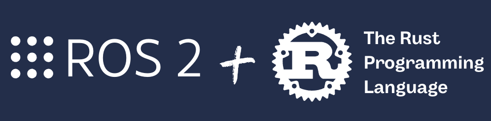
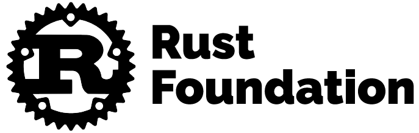

# ROS2 Rust Workshop: Developing Real Robotics Applications with ROS2 and Rust

<p style="text-align: center">
  
</p>

Rust is a language that allows creating efficient, high-quality software.

ROS2, the robotics operating system framework, now offers the possibility to be used with Rust. With this project, you'll learn how to develop nodes in Rust for your real robotics applications.

In this workshop, you'll learn the following:

* [1. What is / Why Rust?](#whatisrust)
* [2. How to install Rust with ROS2](#howtoinstallrust)
* [3. How to run the robot simulation](#setupworkspace)
* [4. How to interact with a robot using ROS2 and Rust](#movearobotwithROS2)
* [4.1 How to create a ROS package in Rust](#createarustrospackage)
* [4.2 Basic Rust programming tips](#basicrustprogrammingtips)
* [4.3 How to create a Subscriber](#howtocreateasubscribertoscantopicinrust)
* [4.4 How to create a Publisher](#howtocreateapublishertocmdvelinrust)
* [4.5 How to create a Subscriber and a Publisher using the same node](#howtocreatasubandpub)
* [4.6 How to create a Service message](#howtocreateasrvmessage)
* [4.7 How to create a Service](#howtocreateaservice)
* [5. Future work](#futurework)

## <a name="whatisrust"></a> 1. What is / Why Rust?

Rust is a systems programming language designed to optimize performance, security, and concurrency. It was originally developed by Mozilla and is now maintained by the Rust Foundation, which includes open-source components.

<div align="center">
    
</div>

Here are some key features and aspects of Rust:

<div align="center">
    
</div>

## <a name="howtoinstallrust"></a> 2. How to Install Rust with ROS2

ROS2 packages cannot be located by default within Rust packages. The only way to work with it currently is to install it from source or using Docker. These resources can be found here:
https://github.com/ros2-rust/ros2_rust.

## <a name="setupworkspace"></a> 3. How to run the robot simulation

1. Run the simulation in _Gazebo_ in `Terminal #1`
   >The simulation may take time to load on first launch. Wait for it to open completely, then press `Ctrl+C` to close it.

```bash
cd ~/ros2_rust_workshop/ros_ws
source /opt/ros/humble/setup.bash 
colcon build
. install/setup.sh
ros2 launch go2_config gazebo_velodyne.launch.py world:=$(ros2 pkg prefix go2_config)/share/go2_config/worlds/outdoor.world
```

> [!WARNING]  
> **_NOTE:_**  If you are using **Ubuntu 24.04** you might encounter issues when opening Gazebo. To resolve this, execute the following command in the terminal: `export DISPLAY=:1` and try to launch again the previous command.


<div align="center">
    
</div>


1. See what *topics* are available. Open a terminal, `terminal #2` and run:

```bash
cd ~/ros2_rust_workshop/ros_ws
source /opt/ros/humble/setup.sh 
. install/setup.sh 
ros2 topic list
```
`terminal #2` Output:

```bash
/base_to_footprint_pose
/body_pose
/clicked_point
/clock
/cmd_vel
/diagnostics
/dynamic_joint_states
/foot
/foot_contacts
/goal_pose
/hokuyo_frame/scan
/imu/data
/initialpose
/joint_group_effort_controller/controller_state
/joint_group_effort_controller/joint_trajectory
/joint_group_effort_controller/state
/joint_group_effort_controller/transition_event
/joint_states
/joint_states_controller/transition_event
/odom
/odom/ground_truth
/odom/local
/odom/raw
/parameter_events
/performance_metrics
/robot_description
/rosout
/set_pose
/tf
/tf_static
/velodyne_points
```

## <a name="movearobotwithROS2"></a> 4. How to interact with a robot using ROS2 and Rust

### <a name="createarustrospackage"></a> 4.1 How to Create a ROS Package in Rust

**Cargo** is the package manager and build tool for Rust. It facilitates dependency management, project building, and testing. Through Cargo, you can compile your code, download and update third-party packages (called _"crates"_), and manage your project configurations.

**Crates** is the name used to refer to Rust packages. A _crate_ is a distributable unit of code that can be a library or an executable. Crates are managed through Cargo, Rust's package manager, which facilitates their publication, installation, and updating. You can find currently available _crates_ on the [Crates.io website](https://crates.io/).

There are two main types of crates:

- **Library crates**: Contain code that can be used by other crates. They don't have a main entry point.
- **Binary crates**: Contain a main entry point (main) that can be run as a standalone program.

Crates are defined in the *Cargo.toml* file, where their dependencies and configurations are specified.

<div align="center">
    
</div>


#### To create a new package:

```bash
$ cargo new <pkg_name>
```

Execute in `terminal #2`:
```bash
cd ~/ros2_rust_workshop/ros_ws/src
cargo new rust_apps
```

Each Cargo package in ROS2 will have the following file and folder structure:

- `src` folder: Contains Rust source files.
- `Cargo.toml`: File where you can define dependencies (_crates_), metadata, and some compiler configurations.
- `Cargo.lock`: Contains exact information about your dependencies. It is maintained by Cargo and should not be edited manually.

These are essential, so remember the following:

- Every ROS2 program you want to run is organized in a package.
- Every ROS2 program you create must be organized in a package.
- Packages are the main organization system for ROS2 programs.

Execute in  `Terminal #2`:
```bash
cd ~/ros2_rust_workshop/ros_ws/src/rust_apps
tree -c
```

`Terminal #2` output:
```bash
.
|-- Cargo.toml
`-- src
    `-- main.rs

1 directory, 2 files
```

For ROS to recognize that this is a ROS package, it's necessary to add a **package.xml** file. This file contains metadata information about the package, such as its name, version, author, and necessary dependencies.

1. Create a new a **package.xml** file inside the _rust_apps_ directory `~/ros2_rust_workshop/ros_ws/src/rust_apps/package.xml`.

2. Copy the following code inside `rust_apps/package.xml`.
```xml
<package format="3">
  <name>rust_apps</name>
  <version>0.0.0</version>
  <description>ROS2 Rust main package</description>
  <maintainer email="user@gmail.com">user</maintainer>
  <license>MIT</license>

  <depend>rclrs</depend>

  <export>
    <build_type>ament_cargo</build_type>
  </export>
</package>
```

The main Rust shortcuts:

- `cargo build`
- `cargo run`
- `cargo install <name of the package>`

> We won't use these commands at all since we're using ROS2, so we'll use ROS2 commands instead.

For large projects, you might not want to compile all packages immediately. Instead, you can follow these approaches:

Execute in `Terminal #2`:
```bash
cd ~/ros2_rust_workshop/ros_ws
colcon build --packages-select rust_apps
source install/setup.sh
```

Now we have the *crate* (ROS2 package) ready to implement a ROS2 node using Rust.

### <a name="basicrustprogrammingtips"></a> 4.2 Basic Rust Programming Tips

#### 4.2.1 Functions

```rust
fn <function_name>(variable:type){} -> <return_type>
```

```rust
fn main() -> Result<(), Error> {}
```

#### 4.2.2 Mutability

To create a new variable and assign it a value, use **let**. If the variable is mutable (meaning its value can change), use **mut**.

```rust
let mut message = std_msgs::msg::String::default();
```

#### 4.2.3 Steps to Create a ROS2 Node in Rust

##### 4.2.3.1 Create the context, shared state between nodes and similar entities.

```rust
let context = rclrs::Context::new(env::args())?;
```

##### 4.2.3.2 Create the node.

```rust
pub fn create_node(
    context: &Context,
    node_name: &str
) -> Result<Arc<Node>, RclrsError>
```

```rust
let node = rclrs::create_node(&context, "<node_name>")?;
```

##### 4.2.3.3 Create a subscriber.

```rust
pub fn create_subscription<T, Args>(
    &self,
    topic: &str,
    qos: QoSProfile,
    callback: impl SubscriptionCallback<T, Args>
) -> Result<Arc<Subscription<T>>, RclrsError>
where
    T: Message,
```

```rust
let _subscription = node.create_subscription::<PointCloud2, _>(
    "velodyne_points",
    rclrs::QOS_PROFILE_DEFAULT,
    move |msg: sensor_msgs::msg::LaserScan| {
        let point_step = msg.point_step as usize; 
        println!("Bytes per point: '{}'", point_step);
    },
)?;
```

##### 4.2.3.4 Create a publisher.

```rust
pub fn create_publisher<T>(
    &self,
    topic: &str,
    qos: QoSProfile
) -> Result<Arc<Publisher<T>>, RclrsError>
where
    T: Message,
```

```rust
let publisher = node.create_publisher::<Twist>("cmd_vel", rclrs::QOS_PROFILE_DEFAULT)?;
publisher.publish(&cmd_vel_message)?;
```

##### 4.2.3.5 Which QoSProfile (Quality of Service Profile) does Rust offers?

- QOS_PROFILE_CLOCK
- QOS_PROFILE_DEFAULT
- QOS_PROFILE_PARAMETERS
- QOS_PROFILE_PARAMETER_EVENTS
- QOS_PROFILE_SENSOR_DATA
- QOS_PROFILE_SERVICES_DEFAULT
- QOS_PROFILE_SYSTEM_DEFAULT

Since the topic of QoS (Quality of Service) is complex and outside the scope of the current learning session, we'll use the default QoS profile, QOS_PROFILE_DEFAULT. If you want to learn more about QoS and how to customize it for your specific needs, I recommend checking the official ROS2 page [QoS](https://docs.ros.org/en/rolling/Concepts/Intermediate/About-Quality-of-Service-Settings.html).

##### 4.2.3.6 ROS spin - use outside a loop.

```rust
pub fn spin(node: Arc<Node>) -> Result<(), RclrsError>
```

```rust
rclrs::spin(node).map_err(|err| err.into())
```

##### 4.2.3.7 ROS spin_once - use inside a loop.

```rust
pub fn spin_once(
    node: Arc<Node>,
    timeout: Option<Duration>
) -> Result<(), RclrsError>
```

```rust
rclrs::spin_once(node.clone(), Some(std::time::Duration::from_millis(500)));
```

#### 4.2.4 Creating and Using Structures and Methods

```rust
struct Rectangle {
    width: u32,
    height: u32,
}

impl Rectangle {
    fn area(&self) -> u32 {
        self.width * self.height
    }
}

```

### <a name="howtocreateasubscribertoscantopicinrust"></a> 4.3 How to Create a Subscriber

#### 4.3.1 Study the Message Contained in the Topic

Let's see how to create a subscriber to the `/velodyne_points` topic using Rust.

1. First, let's subscribe to the topic to see what it contains.

Execute in `Terminal #2`:
```bash
source /opt/ros/humble/setup.sh
ros2 topic echo /velodyne_points
```
`Terminal #2` output:
```bash
header:
  stamp:
    sec: 287
    nanosec: 12000000
  frame_id: velodyne
height: 1
width: 5546
fields:
- name: x
  offset: 0
  datatype: 7
  count: 1
- name: y
  offset: 4
  datatype: 7
  count: 1
- name: z
  offset: 8
  datatype: 7
  count: 1
- name: intensity
  offset: 12
  datatype: 7
  count: 1
- name: ring
  offset: 16
  datatype: 4
  count: 1
- name: time
  offset: 18
  datatype: 7
  count: 1
is_bigendian: false
point_step: 22
row_step: 122012
data:
- 100
- 123
- 51
- 192
- 23
...
```

2. To create a subscriber using Rust, we need to know what type of message and attributes the `/velodyne_points` topic contains.

2.1 Execute in `Terminal #2`:
```bash
ros2 topic info /velodyne_points
```
`Terminal #2` output:
```bash
Type: sensor_msgs/msg/PointCloud2
Publisher count: 1
Subscription count: 0
```

2.2 Execute in `Terminal #2`:
```bash
ros2 interface show sensor_msgs/msg/PointCloud2
```
`Terminal #2` output:
```bash
# Time of sensor data acquisition, and the coordinate frame ID (for 3d points).
std_msgs/Header header
        builtin_interfaces/Time stamp
                int32 sec
                uint32 nanosec
        string frame_id

# 2D structure of the point cloud. If the cloud is unordered, height is
# 1 and width is the length of the point cloud.
uint32 height
uint32 width

# Describes the channels and their layout in the binary data blob.
PointField[] fields
        uint8 INT8    = 1
        uint8 UINT8   = 2
        uint8 INT16   = 3
        uint8 UINT16  = 4
        uint8 INT32   = 5
        uint8 UINT32  = 6
        uint8 FLOAT32 = 7
        uint8 FLOAT64 = 8
        string name      #
        uint32 offset    #
        uint8  datatype  #
        uint32 count     #

bool    is_bigendian # Is this data bigendian?
uint32  point_step   # Length of a point in bytes
uint32  row_step     # Length of a row in bytes
uint8[] data         # Actual point data, size is (row_step*height)

bool is_dense        # True if there are no invalid points

```

#### 4.3.2 Code Implementation

1. Change the file name `main.rs -> scan_subscriber.rs`.

Execute in `Terminal #2`:
```bash
cd ~/ros2_rust_workshop/ros_ws/src/rust_apps/src
mv main.rs scan_subscriber.rs
```


2. Open in code editor `rust_apps/src/scan_subscriber.rs`

```Rust
use std::{
   env,
   f32::consts::PI,
};
use anyhow::{Error, Result};
use sensor_msgs::msg::PointCloud2;
use std::convert::TryInto;

// Constants for obstacle detection
const MAX_DISTANCE_THRESHOLD: f32 = 1.0;  // Maximum distance to detect obstacles
const ANGLE_TOLERANCE: f32 = 0.1;         // Tolerance for angle detection

fn main() -> Result<(), Error> {
   // Initialize ROS2 context and create node
   let context = rclrs::Context::new(env::args())?;
   let node = rclrs::create_node(&context, "scan_subscriber_node")?;

   // Create subscription to velodyne pointcloud topic
   let _subscription = node.create_subscription::<PointCloud2, _>(
       "velodyne_points",
       rclrs::QOS_PROFILE_DEFAULT,
       move |msg: PointCloud2| {
           let point_step = msg.point_step as usize; // Bytes per point
           
           // Process each point in the cloud
           for point in msg.data.chunks(point_step) {
               // Extract x, y coordinates from point data
               let x = f32::from_le_bytes(point[0..4].try_into().unwrap());
               let y = f32::from_le_bytes(point[4..8].try_into().unwrap());
           
               // Calculate angle from x,y coordinates
               let azimuth = y.atan2(x); // Angle in radians

               // Check LEFT side obstacles
               if y.abs() < MAX_DISTANCE_THRESHOLD && (azimuth < PI/2.0 + ANGLE_TOLERANCE) && (azimuth > PI/2.0 - ANGLE_TOLERANCE) {
                   println!("Obstacle detected at LEFT: Orientation {:.2} [rad] and distance {:.2} [m] ", azimuth, y);
                   break;
               }
               // Check RIGHT side obstacles
               if y.abs() < MAX_DISTANCE_THRESHOLD && (azimuth < -PI/2.0 + ANGLE_TOLERANCE) && (azimuth > -PI/2.0 - ANGLE_TOLERANCE) { 
                   println!("Obstacle detected at RIGHT: Orientation {:.2} [rad] and distance {:.2} [m] ", azimuth, y);
                   break;
               }
               // Check FRONT obstacles
               if x.abs() < MAX_DISTANCE_THRESHOLD && azimuth.abs() < ANGLE_TOLERANCE {
                   println!("Obstacle detected at x FRONT: orientation {:.2} [rad] and distance {:.2} [m]", azimuth, x);
                   break;
               }
               // Check BACK obstacles
               if x.abs() < MAX_DISTANCE_THRESHOLD && azimuth.abs() < (PI + ANGLE_TOLERANCE) && (azimuth.abs() > PI - ANGLE_TOLERANCE) {
                   println!("Obstacle detected at x BACK: orientation {:.2} [rad] and distance {:.2} [m]", azimuth, x);
                   break;
               }  
           }
       },
   )?;

   // Start ROS2 spin loop
   rclrs::spin(node).map_err(|err| err.into())
}

```
3. Add ROS2 dependencies manually: Add **sensor_msgs** in the **package.xml** file.

```xml
  <package format="3">
  <name>rust_apps</name>
  <version>0.0.0</version>
  <description>ROS2 Rust main package</description>
  <maintainer email="user@gmail.com">user</maintainer>
  <license>MIT</license>

  <depend>rclrs</depend>
  <depend>sensor_msgs</depend>  
  <export>
    <build_type>ament_cargo</build_type>
  </export>
</package>
```

4. Add dependencies with other _crates_ and link the file with the ROS2 node in `rust_apps/cargo.toml`.


```toml
[package]
name = "rust_apps"
version = "0.1.0"
edition = "2021"

# See more keys and their definitions at https://doc.rust-lang.org/cargo/reference/manifest.html

[dependencies.sensor_msgs]
sensor_msgs = "*"

[[bin]]
name = "scan_subscriber_node"
path = "src/scan_subscriber.rs"
```

6. Add dependencies `automatically`:

Execute in `Terminal #2`:
```bash
cd ~/ros2_rust_workshop/ros_ws/src/rust_apps
cargo add anyhow
cargo add rclrs
```

7. Build the node:

Execute in `Terminal #2`:
```bash
cd ~/ros2_rust_workshop/ros_ws
colcon build --packages-select rust_apps
```

#### 4.3.3 Code Execution

Execute in Terminal #2:
```bash
cd ~/ros2_rust_workshop/ros_ws
source install/setup.sh
ros2 run rust_apps scan_subscriber_node
```

Output:
```
Obstacle detected at x BACK: orientation -3.07 [rad] and distance -0.91 [m]
Obstacle detected at x FRONT: orientation 0.09 [rad] and distance 0.88 [m]
Obstacle detected at LEFT: Orientation 1.48 [rad] and distance 0.96 [m] 
Obstacle detected at LEFT: Orientation 1.48 [rad] and distance 0.90 [m] 
Obstacle detected at x FRONT: orientation -0.09 [rad] and distance 0.94 [m]
Obstacle detected at x BACK: orientation -3.10 [rad] and distance -0.88 [m]
Obstacle detected at x BACK: orientation 3.10 [rad] and distance -0.92 [m]
Obstacle detected at x BACK: orientation -3.14 [rad] and distance -0.90 [m]
Obstacle detected at x FRONT: orientation 0.08 [rad] and distance 0.89 [m]
Obstacle detected at RIGHT: Orientation -1.51 [rad] and distance -0.87 [m] 
...
```


<div align="center">
    
</div>


### <a name="howtocreateapublishertocmdvelinrust"></a> 4.4 How to create a Publisher

#### 4.4.1 Code Implementation

1. Create a new file inside the Rust package *rust_apps* named *cmd_vel_publisher.rs* and paste the following code:

IDE: `rust_apps/src/cmd_vel_publisher.rs`
```rust
use std::env;
use anyhow::{Error, Result};
use geometry_msgs::msg::Twist as Twist;

// Constants for velocity control
const INITIAL_VELOCITY: f64 = 1.0;
const VELOCITY_DECREASE: f64 = 0.05;
const VELOCITY_THRESHOLD: f64 = 1.0;

fn main() -> Result<(), Error> {
    // Initialize ROS2 context
    let context = rclrs::Context::new(env::args())?;
    // Create publisher node
    let node = rclrs::create_node(&context, "cmd_vel_publisher_node")?; 
    // Create Twist message publisher
    let publisher = node.create_publisher::<Twist>("cmd_vel", rclrs::QOS_PROFILE_DEFAULT)?;
    // Initialize Twist message and velocity
    let mut cmd_vel_message = Twist::default();
    let mut velocity = INITIAL_VELOCITY;
    // Main loop
    while context.ok() {
        // Set linear and angular velocities
        cmd_vel_message.linear.x = velocity;
        cmd_vel_message.linear.y = velocity;
        cmd_vel_message.angular.z = 0.0;
        // Reset velocity if below threshold, otherwise decrease
        if velocity < VELOCITY_THRESHOLD*(-1.0) {
            velocity = VELOCITY_THRESHOLD
        } else {
            velocity -= VELOCITY_DECREASE
        };
        // Log and publish message
        println!("Moving velocity lineal x: {:.2} and angular z: {:.2} m/s.",
                cmd_vel_message.linear.x, cmd_vel_message.angular.z);
        publisher.publish(&cmd_vel_message)?;
        // Sleep for 500ms
        std::thread::sleep(std::time::Duration::from_millis(500));
    }
    Ok(())
}
```

2. Add the *geometry_msgs* dependency and add the new node called *cmd_vel_publisher* inside *Cargo.toml*:

Editor: `rust_apps/Cargo.toml`
```toml

[package]
name = "rust_apps"
version = "0.1.0"
edition = "2021"

[dependencies]
anyhow = "1.0.95"
rclrs = "0.4.1"

# See more keys and their definitions at https://doc.rust-lang.org/cargo/reference/manifest.html

[dependencies.sensor_msgs]
sensor_msgs = "*"

[dependencies.geometry_msgs]
geometry_msgs = "*"

[[bin]]
name = "scan_subscriber_node"
path = "src/scan_subscriber.rs"

[[bin]]
name = "cmd_vel_publisher_node"
path = "src/cmd_vel_publisher.rs"


```

Editor: `rust_apps/package.xml`
```xml
<package format="3">
  <name>rust_apps</name>
  <version>0.0.0</version>
  <description>ROS2 Rust main package</description>
  <maintainer email="user@gmail.com">user</maintainer>
  <license>TBD</license>

  <depend>rclrs</depend>
  <depend>sensor_msgs</depend>  
  <depend>geometry_msgs</depend>  
  <export>
    <build_type>ament_cargo</build_type>
  </export>
</package>
```

3. Build the ROS2 package:

Execute in `Terminal #2`:
```bash
cd ~/ros2_rust_workshop/ros_ws
colcon build --packages-select rust_apps
```

#### 4.4.2 Code Execution

Execute in `Terminal #2`:
```bash
cd ~/ros2_rust_workshop/ros_ws
source install/setup.sh
```
4. Open the gazebo window and look through the robot go2 and execute the node `cmd_vel_publisher`.

Execute in `Terminal #2`:
```
source /opt/ros/humble/setup.sh 
ros2 run rust_apps cmd_vel_publisher_node
```


<div align="center">
    
</div>


To stop the robot, you can terminate the program with `Ctrl+C` and then run the following command:

```bash
ros2 topic pub --once /cmd_vel geometry_msgs/msg/Twist '{linear: {x: 0.0, y: 0.0, z: 0.0}, angular: {x: 0.0, y: 0.0, z: 0.0}}'
```

### <a name="howtocreatasubandpub"></a> 4.5 How to create a subscriber and a publisher using the same node

#### 4.5.1 Code Implementation

1. Real projects go beyond simple publish and subscribe models. Let's collaborate to create a Rust structure that includes both a publisher and a subscriber. This structure will allow the robot to navigate autonomously through the simulation environment, avoiding collisions independently.

Code editor: `rust_apps/src/obstacle_avoidance.rs`

``` rust
// Dependencies for ROS2, synchronization and geometry types
use std::{env, sync::{Arc, Mutex}};
use sensor_msgs::msg::PointCloud2 as PointCloud2;
use geometry_msgs::msg::Twist as Twist;
use anyhow::{Error, Result};
use std::f32::consts::PI;

// Configuration constants for robot movement and obstacle detection
const ANGULAR_SPEED: f64 = 0.5;      // Turning speed in rad/s
const LINEAR_SPEED: f64= 2.0;        // Forward/backward speed in m/s
const MAX_DISTANCE_THRESHOLD: f32 = 1.0;  // Minimum distance to obstacle in meters
const ANGLE_TOLERANCE: f32 = 0.1;    // Angle tolerance for direction detection

// Main struct managing obstacle avoidance behavior
struct ObstacleAvoidance {
    _subscription: Arc<rclrs::Subscription<PointCloud2>>,  // LiDAR data subscriber
    publication: Arc<rclrs::Publisher<Twist>>,            // Velocity command publisher
    twist_msg: Arc<Mutex<Twist>>                         // Thread-safe velocity message
}

impl ObstacleAvoidance {
    // Constructor for ObstacleAvoidance system
    pub fn new(node: &rclrs::Node) -> Result<Self, rclrs::RclrsError> {
        let twist_msg = Arc::new(Mutex::new(Twist::default()));
        let publication = node.create_publisher::<Twist>("cmd_vel", rclrs::QOS_PROFILE_DEFAULT)?;
        let twist_msg_clone = Arc::clone(&twist_msg);

        // Subscribe to LiDAR point cloud data
        let _subscription = node.create_subscription::<sensor_msgs::msg::PointCloud2, _>(
            "velodyne_points",
            rclrs::QOS_PROFILE_DEFAULT,
            move |msg: sensor_msgs::msg::PointCloud2| {
                let mut twist_msg = twist_msg_clone.lock().unwrap();
                let point_step = msg.point_step as usize;

                // Process each point in the cloud
                for point in msg.data.chunks(point_step) {
                    // Extract point coordinates
                    let x = f32::from_le_bytes(point[0..4].try_into().unwrap());
                    let y = f32::from_le_bytes(point[4..8].try_into().unwrap());
                    
                    // Calculate point angle relative to robot
                    let azimuth = y.atan2(x);

                    // Default movement: forward
                    twist_msg.linear.x = LINEAR_SPEED; 
                    twist_msg.linear.y = 0.0;
                    twist_msg.angular.z = 0.0; 
    
                    // Check for obstacles in different directions and adjust movement

                    // Left obstacle detection
                    if y.abs() < MAX_DISTANCE_THRESHOLD && (azimuth < PI/2.0 + ANGLE_TOLERANCE) && (azimuth > PI/2.0 - ANGLE_TOLERANCE) {
                        println!("Obstacle detected at LEFT: orientation {:.2} [rad], distance {:.2} [m], turning RIGHT", azimuth, y);
                        twist_msg.linear.x = 0.0; 
                        twist_msg.linear.y = 0.0; 
                        twist_msg.angular.z = -ANGULAR_SPEED;
                        break;
                    }

                    // Right obstacle detection
                    if y.abs() < MAX_DISTANCE_THRESHOLD && (azimuth < -PI/2.0 + ANGLE_TOLERANCE) && (azimuth > -PI/2.0 - ANGLE_TOLERANCE) { 
                        println!("Obstacle detected at RIGHT: orientation {:.2} [rad], distance {:.2} [m], turning LEFT", azimuth, y);
                        twist_msg.linear.x = 0.0; 
                        twist_msg.linear.y = 0.0; 
                        twist_msg.angular.z = ANGULAR_SPEED;
                        break;
                    }

                    // Front obstacle detection
                    if x.abs() < MAX_DISTANCE_THRESHOLD && azimuth.abs() < ANGLE_TOLERANCE {
                        println!("Obstacle detected at FRONT: orientation {:.2} [rad], distance {:.2} [m], going BACKWARD", azimuth, x);
                        twist_msg.linear.x = -LINEAR_SPEED;
                        twist_msg.linear.y = 0.0;
                        twist_msg.angular.z = ANGULAR_SPEED;
                        break;
                    }

                    // Back obstacle detection
                    if x.abs() < MAX_DISTANCE_THRESHOLD && azimuth.abs() < (PI + ANGLE_TOLERANCE) && (azimuth.abs() > PI - ANGLE_TOLERANCE) {
                        println!("Obstacle detected at BACK: orientation {:.2} [rad], distance {:.2} [m], going FORWARD", azimuth, x);
                        twist_msg.linear.x = LINEAR_SPEED;
                        twist_msg.linear.y = 0.0;
                        twist_msg.angular.z = ANGULAR_SPEED;
                        break;
                    }       
                } 
            },
        )?;

        Ok(Self{_subscription, publication, twist_msg})
    }

    // Publish current velocity commands to the robot
    pub fn publish(&self) {
        let twist_msg = self.twist_msg.lock().unwrap();
        let _ = self.publication.publish(&*twist_msg);
    }
}

// Initialize ROS2 node and run obstacle avoidance loop
fn main() -> Result<(), Error> {
    let context = rclrs::Context::new(env::args())?;
    let node = rclrs::create_node(&context, "obstacle_avoidance_node")?;
    let subscriber_node_one = ObstacleAvoidance::new(&node)?;

    while context.ok() {
        subscriber_node_one.publish();
        let _ = rclrs::spin_once(node.clone(), Some(std::time::Duration::from_millis(10)));
        std::thread::sleep(std::time::Duration::from_millis(500));
    }
    Ok(())
}
```
2. Add the new executable in `Cargo.toml`

```toml
[package]
name = "rust_apps"
version = "0.1.0"
edition = "2021"

[dependencies]
anyhow = "1.0.95"
rclrs = "0.4.1"

# See more keys and their definitions at https://doc.rust-lang.org/cargo/reference/manifest.html

[dependencies.sensor_msgs]
sensor_msgs = "*"

[dependencies.geometry_msgs]
geometry_msgs = "*"

[[bin]]
name = "scan_subscriber_node"
path = "src/scan_subscriber.rs"

[[bin]]
name = "cmd_vel_publisher_node"
path = "src/cmd_vel_publisher.rs"

[[bin]]
name = "obstacle_avoidance_node"
path = "src/obstacle_avoidance.rs"
```
Execute in `Terminal #2`:

```bash
cd ~/ros2_rust_workshop/ros_ws
colcon build --packages-select rust_apps
```


#### 4.5.2 Code Execution

Execute in `Terminal #2`:

```bash
source install/setup.sh
ros2 run rust_apps obstacle_avoidance_node
```


<div align="center">
    
</div>


To stop the robot, you can terminate the program with `Ctrl+C` and then run the following command:

```bash
ros2 topic pub --once /cmd_vel geometry_msgs/msg/Twist '{linear: {x: 0.0, y: 0.0, z: 0.0}, angular: {x: 0.0, y: 0.0, z: 0.0}}'
```


### <a name="howtocreateasrvmessage"></a> 4.6 Create a Command.srv message

1. Create a new crate named `rust_msgs`
```bash
cd ~/ros2_rust_workshop/ros_ws/src
cargo new rust_msgs
```

2. Delete the file `Cargo.toml`
```bash
cd ~/ros2_rust_workshop/ros_ws/src/rust_msgs
rm -r Cargo.toml
```

3. Create a `srv` folder and a `Command.srv` file

```bash
cd ~/ros2_rust_workshop/ros_ws/src/rust_msgs
mkdir srv
cd srv
touch Command.srv
```
4. Copy the following message inside `~/ros2_rust_workshop/ros_ws/src/rust_msgs/Command.srv`

```txt
# Command

int32 STOP = 0
int32 START = 1

int32 command

---
bool success
string message
```
5. Create a `CMakeLists.txt` file inside `~/ros2_rust_workshop/ros_ws/src/rust_msgs` and copy the following code:

```cmake
cmake_minimum_required(VERSION 3.5)

project(rust_msgs)

# Default to C++14
if(NOT CMAKE_CXX_STANDARD)
  set(CMAKE_CXX_STANDARD 14)
endif()
if(CMAKE_COMPILER_IS_GNUCXX OR CMAKE_CXX_COMPILER_ID MATCHES "Clang")
  add_compile_options(-Wall -Wextra -Wpedantic)
endif()

find_package(ament_cmake REQUIRED)
find_package(rosidl_default_generators REQUIRED)

set(srv_files
  "srv/Command.srv"
)

rosidl_generate_interfaces(${PROJECT_NAME}
  ${srv_files}
)

ament_export_dependencies(rosidl_default_runtime)

ament_package()
```
6. Create a `package.xml` inside  `~/ros2_rust_workshop/ros_ws/src/rust_msgs` and add `ament`, `rosidl_default_generators`, `rosidl_default_runtime` and `rosidl_interface_packages` dependencies respectively:
```xml
<?xml version="1.0"?>
<?xml-model href="http://download.ros.org/schema/package_format3.xsd" schematypens="http://www.w3.org/2001/XMLSchema"?>
<package format="3">
  <name>rust_msgs</name>
  <version>0.4.1</version>
  <description>A package containing some example message definitions.</description>
  <maintainer email="user@gmail.com">user</maintainer>
  <license>TBD</license>

  <buildtool_depend>ament_cmake</buildtool_depend>
  <buildtool_depend>rosidl_default_generators</buildtool_depend>

  <exec_depend>rosidl_default_runtime</exec_depend>

  <test_depend>ament_lint_common</test_depend>

  <member_of_group>rosidl_interface_packages</member_of_group>

  <export>
    <build_type>ament_cmake</build_type>
  </export>
</package>
```
5. Build and source:

```bash
cd ~/ros2_rust_workshop/ros_ws
colcon build --packages-select rust_msgs
source install/setup.sh
```
6. Verify with:
```bash
ros2 interface show rust_msgs/srv/Command
```
Output: 
```bash
# Command

int32 STOP = 0
int32 START = 1

int32 command

---
bool success
string message
```


### <a name="howtocreateaservice"></a> 4.7 How to create a Service:

#### 4.7.1 How to create a Service Server:

1. Create a file in  `~/ros2_rust_workshop/ros_ws/src/rust_apps/src` called `cmd_service_server.rs`:

```bash
cd ~/ros2_rust_workshop/ros_ws/src/rust_apps/src
touch cmd_service_server.rs
```

2. Paste the following code in  `~/ros2_rust_workshop/ros_ws/src/rust_apps/src/cmd_service_server.rs`

```rust
use std::env;
use anyhow::{Error, Result};
use std::sync::Arc;
use geometry_msgs::msg::{Twist, Vector3}; // Simplify imports for better clarity

// Command constants for better readability and to avoid magic numbers
const STOP: i32 = 0;
const START: i32 = 1;

/// Handles incoming service requests to control the robot
///
/// # Arguments
/// * `_request_header` - Metadata for the request (not used here but required by ROS2 service definition).
/// * `request` - The service request containing the command (STOP or START).
/// * `publisher` - A shared publisher to send velocity commands to the robot.
///
/// # Returns
/// A response indicating success or failure of the command execution.
fn handle_service(
    _request_header: &rclrs::rmw_request_id_t,
    request: rust_msgs::srv::Command_Request,
    publisher: Arc<rclrs::Publisher<Twist>>,
) -> rust_msgs::srv::Command_Response {
    // Initialize a default Twist message with zero velocities
    let mut twist_msg = Twist {
        linear: Vector3 { x: 0.0, y: 0.0, z: 0.0 },
        angular: Vector3 { x: 0.0, y: 0.0, z: 0.0 },
    };

    match request.command {
        STOP => {
            // Publish a stop command (zero velocities)
            if let Err(err) = publisher.publish(&twist_msg) {
                eprintln!("Failed to publish STOP command: {}", err);
                return rust_msgs::srv::Command_Response {
                    message: "Failed to stop robot".to_string(),
                    success: false,
                };
            }
            rust_msgs::srv::Command_Response {
                message: "Stopping Robot".to_string(),
                success: true,
            }
        }
        START => {
            // Update the Twist message to move forward and rotate slightly
            twist_msg.linear.x = 1.0; // Move forward
            twist_msg.angular.z = 0.1; // Slight rotation

            // Publish the start command
            if let Err(err) = publisher.publish(&twist_msg) {
                eprintln!("Failed to publish START command: {}", err);
                return rust_msgs::srv::Command_Response {
                    message: "Failed to start robot".to_string(),
                    success: false,
                };
            }
            rust_msgs::srv::Command_Response {
                message: "Starting Robot".to_string(),
                success: true,
            }
        }
        _ => {
            // Handle invalid commands
            rust_msgs::srv::Command_Response {
                message: "Invalid command".to_string(),
                success: false,
            }
        }
    }
}

fn main() -> Result<(), Error> {
    // Initialize the ROS2 context
    let context = rclrs::Context::new(env::args())?;

    // Create a new ROS2 node
    let node = rclrs::create_node(&context, "cmd_service_server")?;

    // Create a publisher for the `cmd_vel` topic
    let cmd_vel_publisher = node.create_publisher::<Twist>("cmd_vel", rclrs::QOS_PROFILE_DEFAULT)?;

    // Create a service for handling robot commands
    let _server = node.create_service::<rust_msgs::srv::Command, _>("command", move |req_header, request| {
        // Use a closure to pass the publisher to the service handler
        handle_service(req_header, request, cmd_vel_publisher.clone())
    })?;

    println!("Starting server. Waiting for requests...");

    // Spin the node to process incoming service requests
    rclrs::spin(node).map_err(|err| err.into())
}
```

3. Add a new executable in `~/ros2_rust_workshop/ros_ws/src/rust_apps/Cargo.toml`

```toml
(...)
[dependencies.rust_msgs]
rust_msgs = "*"

(...)
[[bin]]
name = "cmd_service_server"
path = "src/cmd_service_server.rs"
```
4. Using the `terminal #2` Compile latest changes and execute the server:

```bash
cd ~/ros2_rust_workshop/ros_ws
colcon build --packages-select rust_apps
source install/setup.bash
ros2 run rust_apps cmd_service_server
```

5. Open a new terminal and make client requests running the following commands:

5.1 GO2 robot will start moving after sending the following command request:

```bash
cd ~/ros2_rust_workshop/ros_ws
source install/setup.sh
ros2 service call /command rust_msgs/srv/Command "{command: 1}"
```
Output:
```
requester: making request: rust_msgs.srv.Command_Request(command=1)

response:
rust_msgs.srv.Command_Response(success=True, message='Starting Robot')
```

5.2 GO2 robot will stop moving after sending the following command request:

```bash
ros2 service call /command rust_msgs/srv/Command "{command: 0}"
```
Output:
```
requester: making request: rust_msgs.srv.Command_Request(command=0)

response:
rust_msgs.srv.Command_Response(success=True, message='Stopping Robot')
```

5.3 Stop the service server:

Write `CTRL+C` in `terminal #2`


#### 4.7.2 How to create a Service Client:

1. Create two different files inside `~/ros2_rust_workshop/ros_ws/src/rust_apps/src`

```bash
cd ~/ros2_rust_workshop/ros_ws/src/rust_apps/src
touch cmd_service_client_start.rs
touch cmd_service_client_stop.rs

```
2. Copy the following code inside `~/ros2_rust_workshop/ros_ws/src/rust_apps/src/cmd_service_client_start.rs`
```rust
use std::env;

use anyhow::{Error, Result};
const START: i32 = 1;

fn main() -> Result<(), Error> {
    let context = rclrs::Context::new(env::args())?;

    let node = rclrs::create_node(&context, "cmd_service_client_stop")?;

    let client = node.create_client::<rust_msgs::srv::Command>("command")?;

    let request = rust_msgs::srv::Command_Request { command: START };

    println!("Starting client");

    while !client.service_is_ready()? {
        std::thread::sleep(std::time::Duration::from_millis(10));
    }

    client.async_send_request_with_callback(
        &request,
        move |response: rust_msgs::srv::Command_Response| {
            println!(
                "Request command is {} and response is {} with message {}",
                request.command, response.success, response.message
            );
        }
    )?;

    std::thread::sleep(std::time::Duration::from_millis(500));

    println!("Waiting for response");
    rclrs::spin(node).map_err(|err| err.into())
}
```

3. Copy the following code inside `~/ros2_rust_workshop/ros_ws/src/rust_apps/src/cmd_service_client_stop.rs`
```rust
use std::env;

use anyhow::{Error, Result};
const STOP: i32 = 0;

fn main() -> Result<(), Error> {
    let context = rclrs::Context::new(env::args())?;

    let node = rclrs::create_node(&context, "cmd_service_client_stop")?;

    let client = node.create_client::<rust_msgs::srv::Command>("command")?;

    let request = rust_msgs::srv::Command_Request { command: STOP };

    println!("Starting client");

    while !client.service_is_ready()? {
        std::thread::sleep(std::time::Duration::from_millis(10));
    }

    client.async_send_request_with_callback(
        &request,
        move |response: rust_msgs::srv::Command_Response| {
            println!(
                "Request command is {} and response is {} with message {}",
                request.command, response.success, response.message
            );
        }
    )?;

    std::thread::sleep(std::time::Duration::from_millis(500));

    println!("Waiting for response");
    rclrs::spin(node).map_err(|err| err.into())
}
```
4. Add a two new executable in `~/ros2_rust_workshop/ros_ws/src/rust_apps/Cargo.toml`

```toml
(...)

[[bin]]
name = "cmd_service_client_start"
path = "src/cmd_service_client_start.rs"

[[bin]]
name = "cmd_service_client_stop"
path = "src/cmd_service_client_stop.rs"
```
5. Using the `terminal #2` execute the server:
```bash
cd ~/ros2_rust_workshop/ros_ws
colcon build --packages-select rust_apps
source install/setup.bash
ros2 run rust_apps cmd_service_server
```
6. Using the `terminal #3` compile latest changes and execute the first client:
```bash
cd ~/ros2_rust_workshop/ros_ws
source install/setup.bash
ros2 run rust_apps cmd_service_client_start
```

Go2 robot should start walking.

7. Using the `terminal #4` compile latest changes and execute the second client:
```bash
cd ~/ros2_rust_workshop/ros_ws
source install/setup.bash
ros2 run rust_apps cmd_service_client_stop
```
Go2 robot should stop walking.

>You can proceed killing all the terminals with `Ctrl+C`


## 5. Future work

Now you are prepared to create nodes in Rust. To further improve your competence, I recommend that you review the following courses and documentation:

ROS2 Rust:
- [ROS2 Rust Repository](https://github.com/ros2-rust/ros2_rust)
- [ROS2 Basics in 3 Days (Rust)](https://app.theconstruct.ai/courses/168)
- [ROS2 with Rust | ROS2 Developers Open Class - The Construct](https://youtu.be/ShCnUasOBzU?feature=shared)
- [Build a ROS2 Node with Rust - Mike](https://www.youtube.com/watch?v=U5wHiZpNdvg)
- [Current state of ROS2 Rust libraries - ROS discourse](https://discourse.ros.org/t/current-state-of-rust-client-libraries-which-one-to-use-ros2-client-rus2-ros2-rust-rclrust-rosrust-or-r2r/39119)

Learn Rust:
- [The Rust Book](https://doc.rust-lang.org/book/)
- [The Rust Reference Book](https://doc.rust-lang.org/reference/)
- [The 9 Best Rust Programming Courses and Books for Beginners in 2024](https://medium.com/javarevisited/7-best-rust-programming-courses-and-books-for-beginners-in-2021-2ed2311af46c)

<br>
<br>

<br>


<div align="center">
    
</div>
