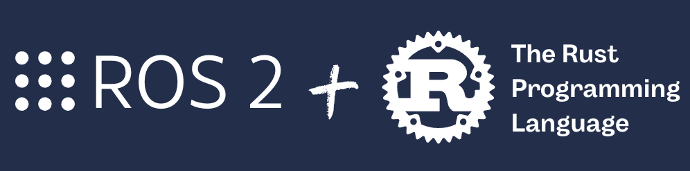
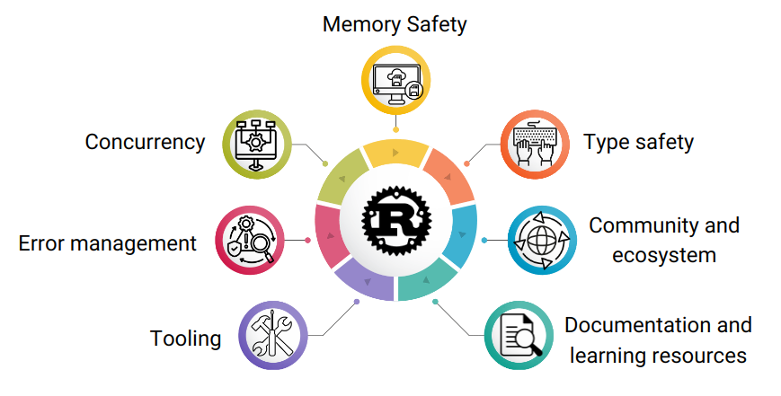
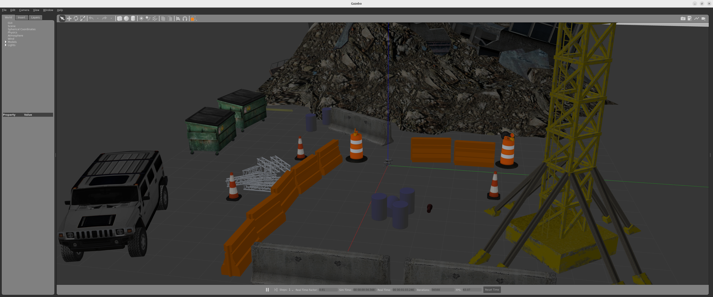
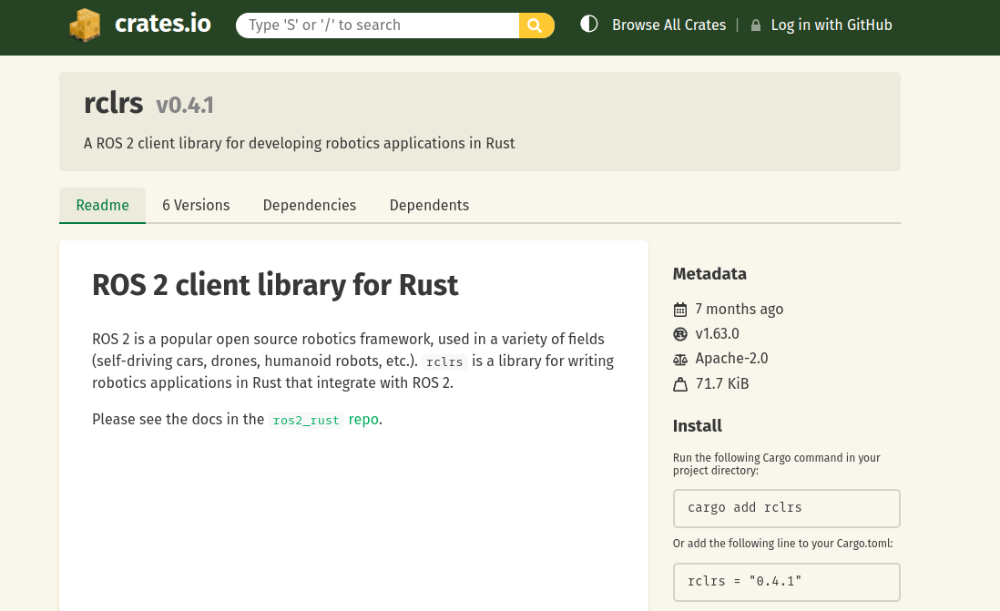

# Atelier ROS2 Rust : Développer des applications robotiques réelles avec ROS2 et Rust

<p style="text-align: center">
  
</p>

Rust est un langage qui permet de créer des logiciels efficaces et de haute qualité.

ROS2, le système d'exploitation robotique, permet désormais d'être utilisé avec Rust. Grâce à ce projet, vous apprendrez à développer des nœuds en Rust pour vos applications robotiques réelles.

Dans cet atelier, vous apprendrez à :

* [1. Qu'est-ce que / Pourquoi Rust ?](#whatisrust)
* [2. Comment installer Rust avec ROS2](#howtoinstallrust)
* [3. Comment exécuter la simulation d'un robot](#setupworkspace)
* [4. Comment interagir avec un robot en utilisant ROS2 et Rust](#movearobotwithROS2)
* [4.1 Comment créer un package ROS en Rust](#createarustrospackage)
* [4.2 Conseils de base pour programmer en Rust](#basicrustprogrammingtips)
* [4.3 Comment créer un Subscriber](#howtocreateasubscribertoscantopicinrust)
* [4.4 Comment créer un Publisher](#howtocreateapublishertocmdvelinrust)
* [4.5 Comment créer un Subscriber et un Publisher dans le même nœud](#howtocreatasubandpub) 
* [4.6 Comment créer un message de Service](#howtocreateasrvmessage) 
* [4.7 Comment créer un Service](#howtocreateaservice) 
* [5. Travaux futurs](#futurework)

## <a name="whatisrust"></a> 1. Qu'est-ce que / Pourquoi Rust ?

Rust est un langage de programmation système conçu pour optimiser les performances, la sécurité et la concurrence. Développé à l'origine par Mozilla, il est désormais maintenu par la Fondation Rust, qui regroupe des composants open-source.

<div align="center">
    
</div>

Voici quelques caractéristiques clés de Rust :

<div align="center">
    
</div>

## <a name="howtoinstallrust"></a> 2. Comment installer Rust avec ROS2

Par défaut, les packages ROS2 ne sont pas reconnus dans les projets Rust. Il faut donc les installer depuis les sources ou utiliser Docker. Les ressources sont disponibles ici :
https://github.com/ros2-rust/ros2_rust.

## <a name="setupworkspace"></a> 3. Comment exécuter la simulation d'un robot

1. Lancez la simulation dans _Gazebo_ dans le `terminal #1`
   >Le chargement initial peut prendre du temps. Attendez que la simulation s’ouvre complètement, puis utilisez 'Ctrl+C' pour la fermer.

```bash
cd ~/ros_ws
source /opt/ros/humble/setup.bash 
colcon build
source install/setup.bash
ros2 launch go2_config gazebo_velodyne.launch.py world:=$(ros2 pkg prefix go2_config)/share/go2_config/worlds/outdoor.world
```

> [!WARNING]  
> **_NOTE :_** Si vous utilisez **Ubuntu 24.04**, vous pourriez rencontrer des problèmes pour lancer Gazebo. Dans ce cas, exécutez : 'export DISPLAY=:1' puis relancez la commande précédente.


<div align="center">
    
</div>


2. Listez les *topics* disponibles dans le `terminal #2`:

```bash
cd ~/ros_ws
source /opt/ros/humble/setup.sh 
source install/setup.bash
ros2 topic list
```
Sortie du `terminal #2` :

```bash
/base_to_footprint_pose
/body_pose
/clicked_point
/clock
/cmd_vel
/diagnostics
/dynamic_joint_states
/foot
/foot_contacts
/goal_pose
/hokuyo_frame/scan
/imu/data
/initialpose
/joint_group_effort_controller/controller_state
/joint_group_effort_controller/joint_trajectory
/joint_group_effort_controller/state
/joint_group_effort_controller/transition_event
/joint_states
/joint_states_controller/transition_event
/odom
/odom/ground_truth
/odom/local
/odom/raw
/parameter_events
/performance_metrics
/robot_description
/rosout
/set_pose
/tf
/tf_static
/velodyne_points
```

## <a name="movearobotwithROS2"></a> 4. Comment interagir avec un robot en utilisant ROS2 et Rust

### <a name="createarustrospackage"></a> 4.1 Comment créer un package ROS en Rust

**Cargo** est le gestionnaire de paquets et l’outil de compilation de Rust. Il facilite la gestion des dépendances, la compilation du projet et les tests. Grâce à Cargo, vous pouvez compiler votre code, télécharger et mettre à jour des paquets tiers (appelés _crates_) et gérer les configurations de votre projet.

**Crates** est le terme utilisé pour désigner les paquets Rust. Un _crate_ est une unité de code distribuable, qui peut être une bibliothèque ou un exécutable. Les crates sont gérées par Cargo, qui facilite leur publication, installation et mise à jour. Vous pouvez retrouver les crates disponibles sur [crates.io](https://crates.io/).

Il existe deux types principaux de crates :

- **Crates de bibliothèque** : contiennent du code réutilisable par d'autres crates. Ils n'ont pas de point d’entrée `main`.
- **Crates binaires** : contiennent un point d’entrée `main` et peuvent être exécutés comme programmes autonomes.

Les crates sont définies dans le fichier *Cargo.toml*, où vous spécifiez les dépendances et les configurations du compilateur.

<div align="center">
    
</div>


#### Pour créer un nouveau package:

```bash
$ cargo new <nom_du_package>
```

Dans le `terminal #2`:
```bash
cd ~/ros_ws/src
cargo new rust_apps
```

Chaque package Cargo dans ROS2 aura la structure de fichiers suivante :

- Dossier `src` : contient les fichiers source Rust.
- `Cargo.toml` : fichier de configuration avec les dépendances (_crates_), les métadonnées, etc.
- `Cargo.lock` : fichier généré automatiquement contenant les versions précises des dépendances.

Points essentiels à retenir :

- Chaque programme ROS2 est organisé en package.
- Chaque programme ROS2 que vous développez **doit** être dans un package.
- Les packages sont la structure principale d’organisation dans ROS2.

Toujours dans le `terminal #2` :
```bash
cd ~/ros_ws/src/rust_apps
tree -c
```

Sortie du `terminal #2`:
```bash
.
|-- Cargo.toml
`-- src
    `-- main.rs

1 directory, 2 files
```

Pour que ROS reconnaisse ce package comme un package ROS2, il faut ajouter un fichier **package.xml**.

1. Créez le fichier `package.xml` dans `~/ros_ws/src/rust_apps/`.

2. Copiez-y le contenu suivant :
```xml
<package format="3">
  <name>rust_apps</name>
  <version>0.0.0</version>
  <description>ROS2 Rust main package</description>
  <maintainer email="user@gmail.com">user</maintainer>
  <license>MIT</license>

  <depend>rclrs</depend>

  <export>
    <build_type>ament_cargo</build_type>
  </export>
</package>
```

Principales commandes Cargo :

- `cargo build`
- `cargo run`
- `cargo install <nom du package>`

> On **n’utilisera pas** ces commandes dans cet atelier car on passera par ROS2.

Pour des projets plus gros, il est recommandé de compiler uniquement certains packages :

Dans le `terminal #2`:
```bash
cd ~/ros_ws
colcon build --packages-select rust_apps
source install/setup.sh
```

Le crate (package ROS2 Rust) est maintenant prêt à contenir un nœud ROS2 en Rust.

### <a name="basicrustprogrammingtips"></a> 4.2 Conseils de base pour programmer en Rust

#### 4.2.1 Fonctions

La syntaxe générale pour une fonction en Rust est :

```rust
fn <function_name>(variable:type){} -> <return_type>
```

Exemple :
```rust
fn main() -> Result<(), Error> {}
```

#### 4.2.2 Mutabilité

Pour déclarer une nouvelle variable, utilisez **`let`**.  
Si cette variable doit être modifiable, ajoutez **`mut`** :

```rust
let mut message = std_msgs::msg::String::default();
```

#### 4.2.3 Étapes pour créer un nœud ROS2 en Rust

##### 4.2.3.1 Créer le contexte ROS2

Le contexte est un état partagé entre les nœuds et autres entités ROS2.

```rust
let context = rclrs::Context::new(env::args())?;
```

##### 4.2.3.2 Créer le nœud

```rust
pub fn create_node(
    context: &Context,
    node_name: &str
) -> Result<Arc<Node>, RclrsError>
```

```rust
let node = rclrs::create_node(&context, "<node_name>")?;
```

##### 4.2.3.3 Créer un Subscriber

```rust
pub fn create_subscription<T, Args>(
    &self,
    topic: &str,
    qos: QoSProfile,
    callback: impl SubscriptionCallback<T, Args>
) -> Result<Arc<Subscription<T>>, RclrsError>
where
    T: Message,
```

```rust
let _subscription = node.create_subscription::<PointCloud2, _>(
    "velodyne_points",
    rclrs::QOS_PROFILE_DEFAULT,
    move |msg: PointCloud2| {
        let point_step = msg.point_step as usize;
        println!("Octets par point: '{}'", point_step);
    },
)?;
```

##### 4.2.3.4 Créer un Publisher

```rust
pub fn create_publisher<T>(
    &self,
    topic: &str,
    qos: QoSProfile
) -> Result<Arc<Publisher<T>>, RclrsError>
where
    T: Message,
```

```rust
let publisher = node.create_publisher::<Twist>("cmd_vel", rclrs::QOS_PROFILE_DEFAULT)?;
publisher.publish(&cmd_vel_message)?;
```

##### 4.2.3.5 Créer un serveur de Service

```rust
pub fn create_service<T, F>(
    &self,
    topic: &str,
    callback: F,
) -> Result<Arc<Service<T>>, RclrsError>
where
    T: Service,
    F: Fn(&rmw_request_id_t, T::Request) -> T::Response + 'static + Send,
```

```rust
let _server = node.create_service::<rust_msgs::srv::Command, _>("command", move |req_header, request| {
    handle_service(req_header, request, cmd_vel_publisher.clone())
    })?;
```


##### 4.2.3.6 Créer un client de Service

```rust
pub fn create_client<T>(
    &self,
    topic: &str,
) -> Result<Arc<Client<T>>, RclrsError>
where
    T: Service,
```
```rust
let client = node.create_client::<rust_msgs::srv::Command>("command")?;
```

##### 4.2.3.7 Profils de qualité de service (QoS)

Rust propose plusieurs profils QoS intégrés :

- QOS_PROFILE_CLOCK
- QOS_PROFILE_DEFAULT
- QOS_PROFILE_PARAMETERS
- QOS_PROFILE_PARAMETER_EVENTS
- QOS_PROFILE_SENSOR_DATA
- QOS_PROFILE_SERVICES_DEFAULT
- QOS_PROFILE_SYSTEM_DEFAULT

> Pour cet atelier, on utilise `QOS_PROFILE_DEFAULT` par défaut.  
> Pour en savoir plus sur la QoS, consultez :  
> [ROS2 QoS Settings](https://docs.ros.org/en/rolling/Concepts/Intermediate/About-Quality-of-Service-Settings.html)

##### 4.2.3.8 ROS spin - à utiliser en dehors d’une boucle

```rust
pub fn spin(&self) -> Result<(), RclrsError>
```

```rust
rclrs::spin(node).map_err(|err| err.into())
```

##### 4.2.3.9 ROS spin_once - à utiliser **dans** une boucle

```rust
pub fn spin_once(
    node: Arc<Node>,
    timeout: Option<Duration>
) -> Result<(), RclrsError>

```

```rust
rclrs::spin_once(node.clone(), Some(std::time::Duration::from_millis(500)));
```

#### 4.2.4 Définir et utiliser des structures et méthodes

Exemple simple avec une struct `Rectangle` :

```rust
struct Rectangle {
    width: u32,
    height: u32,
}

impl Rectangle {
    fn area(&self) -> u32 {
        self.width * self.height
    }
}
```

### <a name="howtocreateasubscribertoscantopicinrust"></a> 4.3 Comment créer un Subscriber

#### 4.3.1 Étudier le message contenu dans le topic

Prenons comme exemple la création d’un subscriber au topic `/velodyne_points` en Rust.

1. Pour commencer, examinons ce que contient ce topic.

Dans le `terminal #2`:
```bash
source /opt/ros/humble/setup.sh
ros2 topic echo /velodyne_points
```
Sortie du `terminal #2`:
```bash
header:
  stamp:
    sec: 287
    nanosec: 12000000
  frame_id: velodyne
height: 1
width: 5546
fields:
- name: x
  offset: 0
  datatype: 7
  count: 1
- name: y
  offset: 4
  datatype: 7
  count: 1
- name: z
  offset: 8
  datatype: 7
  count: 1
- name: intensity
  offset: 12
  datatype: 7
  count: 1
- name: ring
  offset: 16
  datatype: 4
  count: 1
- name: time
  offset: 18
  datatype: 7
  count: 1
is_bigendian: false
point_step: 22
row_step: 122012
data:
- 100
- 123
- 51
- 192
- 23
...
```

2. On doit connaître le **type de message** utilisé par le topic pour pouvoir l’utiliser dans notre code.

2.1 Dans le `terminal #2`:
```bash
ros2 topic info /velodyne_points
```

Sortie du `terminal #2`:
```bash
Type: sensor_msgs/msg/PointCloud2
Publisher count: 1
Subscription count: 0
```

2.2 Affichons les détails du type de message dans le `terminal #2`:
```bash
ros2 interface show sensor_msgs/msg/PointCloud2
```

Sortie du`terminal #2`:
```bash
# Time of sensor data acquisition, and the coordinate frame ID (for 3d points).
std_msgs/Header header
        builtin_interfaces/Time stamp
                int32 sec
                uint32 nanosec
        string frame_id

# 2D structure of the point cloud. If the cloud is unordered, height is
# 1 and width is the length of the point cloud.
uint32 height
uint32 width

# Describes the channels and their layout in the binary data blob.
PointField[] fields
        uint8 INT8    = 1
        uint8 UINT8   = 2
        uint8 INT16   = 3
        uint8 UINT16  = 4
        uint8 INT32   = 5
        uint8 UINT32  = 6
        uint8 FLOAT32 = 7
        uint8 FLOAT64 = 8
        string name      #
        uint32 offset    #
        uint8  datatype  #
        uint32 count     #

bool    is_bigendian # Is this data bigendian?
uint32  point_step   # Length of a point in bytes
uint32  row_step     # Length of a row in bytes
uint8[] data         # Actual point data, size is (row_step*height)

bool is_dense        # True if there are no invalid points

```

#### 4.3.2 Implémentation du code

1. Changer le nom du fichier en `main.rs -> scan_subscriber.rs`.

Executer dans le `terminal #2`:
```bash
cd ~/ros_ws/src/rust_apps/src
mv main.rs scan_subscriber.rs
```


2. Ouvrez `scan_subscriber.rs` et collez le code suivant :

```Rust
use std::{
    env,
    f32::consts::PI,
 };
 use anyhow::{Error, Result};
 use sensor_msgs::msg::PointCloud2;
 use std::convert::TryInto;
 
 // Constants for obstacle detection
 const MAX_DISTANCE_THRESHOLD: f32 = 1.0;  // Maximum distance to detect obstacles
 const ANGLE_TOLERANCE: f32 = 0.1;         // Tolerance for angle detection
 
 fn main() -> Result<(), Error> {
    // Initialize ROS2 context and create node
    let context = rclrs::Context::new(env::args())?;
    let node = rclrs::create_node(&context, "scan_subscriber_node")?;
 
    // Create subscription to velodyne pointcloud topic
    let _subscription = node.create_subscription::<PointCloud2, _>(
        "velodyne_points",
        rclrs::QOS_PROFILE_DEFAULT,
        move |msg: PointCloud2| {
            let point_step = msg.point_step as usize; // Bytes per point
            
            // Process each point in the cloud
            for point in msg.data.chunks(point_step) {
                // Extract x, y coordinates from point data
                let x = f32::from_le_bytes(point[0..4].try_into().unwrap());
                let y = f32::from_le_bytes(point[4..8].try_into().unwrap());
            
                // Calculate angle from x,y coordinates
                let azimuth = y.atan2(x); // Angle in radians
 
                // Check LEFT side obstacles
                if y.abs() < MAX_DISTANCE_THRESHOLD && (azimuth < PI/2.0 + ANGLE_TOLERANCE) && (azimuth > PI/2.0 - ANGLE_TOLERANCE) {
                    println!("Obstacle detected at LEFT: Orientation {:.2} [rad] and distance {:.2} [m] ", azimuth, y);
                    break;
                }
                // Check RIGHT side obstacles
                if y.abs() < MAX_DISTANCE_THRESHOLD && (azimuth < -PI/2.0 + ANGLE_TOLERANCE) && (azimuth > -PI/2.0 - ANGLE_TOLERANCE) { 
                    println!("Obstacle detected at RIGHT: Orientation {:.2} [rad] and distance {:.2} [m] ", azimuth, y);
                    break;
                }
                // Check FRONT obstacles
                if x.abs() < MAX_DISTANCE_THRESHOLD && azimuth.abs() < ANGLE_TOLERANCE {
                    println!("Obstacle detected at x FRONT: orientation {:.2} [rad] and distance {:.2} [m]", azimuth, x);
                    break;
                }
                // Check BACK obstacles
                if x.abs() < MAX_DISTANCE_THRESHOLD && azimuth.abs() < (PI + ANGLE_TOLERANCE) && (azimuth.abs() > PI - ANGLE_TOLERANCE) {
                    println!("Obstacle detected at x BACK: orientation {:.2} [rad] and distance {:.2} [m]", azimuth, x);
                    break;
                }  
            }
        },
    )?;
 
    // Start ROS2 spin loop
    rclrs::spin(node).map_err(|err| err.into())
 }

```
3. Ajoutez la dépendance `sensor_msgs` dans le fichier `package.xml` :

```xml
  <package format="3">
  <name>rust_apps</name>
  <version>0.0.0</version>
  <description>ROS2 Rust main package</description>
  <maintainer email="user@gmail.com">user</maintainer>
  <license>MIT</license>

  <depend>rclrs</depend>
  <depend>sensor_msgs</depend>  
  <export>
    <build_type>ament_cargo</build_type>
  </export>
</package>
```

4. Dans le fichier `Cargo.toml`, ajoutez ce qui suit pour y lier le fichier du nœud ROS2:


```toml
[package]
name = "rust_apps"
version = "0.1.0"
edition = "2021"

# See more keys and their definitions at https://doc.rust-lang.org/cargo/reference/manifest.html

[dependencies]
sensor_msgs = "*"

[[bin]]
name = "scan_subscriber_node"
path = "src/scan_subscriber.rs"
```

6. Ajoutez les dépendances nécessaires automatiquement :

Dans le `terminal #2`:
```bash
cd ~/ros_ws/src/rust_apps
cargo add anyhow
cargo add rclrs
```

7. Compilez le package :

```bash
cd ~/ros_ws
colcon build --packages-select rust_apps
```

#### 4.3.3 Exécution du code

Dans le terminal :
```bash
cd ~/ros_ws
source install/setup.sh
ros2 run rust_apps scan_subscriber_node
```

Sortie:
```
Obstacle detected at x BACK: orientation -3.07 [rad] and distance -0.91 [m]
Obstacle detected at x FRONT: orientation 0.09 [rad] and distance 0.88 [m]
Obstacle detected at LEFT: Orientation 1.48 [rad] and distance 0.96 [m] 
Obstacle detected at LEFT: Orientation 1.48 [rad] and distance 0.90 [m] 
Obstacle detected at x FRONT: orientation -0.09 [rad] and distance 0.94 [m]
Obstacle detected at x BACK: orientation -3.10 [rad] and distance -0.88 [m]
Obstacle detected at x BACK: orientation 3.10 [rad] and distance -0.92 [m]
Obstacle detected at x BACK: orientation -3.14 [rad] and distance -0.90 [m]
Obstacle detected at x FRONT: orientation 0.08 [rad] and distance 0.89 [m]
Obstacle detected at RIGHT: Orientation -1.51 [rad] and distance -0.87 [m] 
...
```


<div align="center">
    
</div>


### <a name="howtocreateapublishertocmdvelinrust"></a> 4.4 Comment créer un Publisher

#### 4.4.1 Implémentation du code

1. Créez un nouveau fichier appelé `cmd_vel_publisher.rs` dans le dossier `rust_apps/src` et collez le code suivant :

IDE: `rust_apps/src/cmd_vel_publisher.rs`
```rust
use std::env;
use anyhow::{Error, Result};
use geometry_msgs::msg::Twist as Twist;

// Constants for velocity control
const INITIAL_VELOCITY: f64 = 1.0;
const VELOCITY_DECREASE: f64 = 0.05;
const VELOCITY_THRESHOLD: f64 = 1.0;

fn main() -> Result<(), Error> {
    // Initialize ROS2 context
    let context = rclrs::Context::new(env::args())?;
    // Create publisher node
    let node = rclrs::create_node(&context, "cmd_vel_publisher_node")?; 
    // Create Twist message publisher
    let publisher = node.create_publisher::<Twist>("cmd_vel", rclrs::QOS_PROFILE_DEFAULT)?;
    // Initialize Twist message and velocity
    let mut cmd_vel_message = Twist::default();
    let mut velocity = INITIAL_VELOCITY;
    // Main loop
    while context.ok() {
        // Set linear and angular velocities
        cmd_vel_message.linear.x = velocity;
        cmd_vel_message.linear.y = velocity;
        cmd_vel_message.angular.z = 0.0;
        // Reset velocity if below threshold, otherwise decrease
        if velocity < VELOCITY_THRESHOLD*(-1.0) {
            velocity = VELOCITY_THRESHOLD
        } else {
            velocity -= VELOCITY_DECREASE
        };
        // Log and publish message
        println!("Moving velocity lineal x: {:.2} and angular z: {:.2} m/s.",
                cmd_vel_message.linear.x, cmd_vel_message.angular.z);
        publisher.publish(&cmd_vel_message)?;
        // Sleep for 500ms
        std::thread::sleep(std::time::Duration::from_millis(500));
    }
    Ok(())
}
```

2. Ajoutez la dépendance `geometry_msgs` et l’entrée du nouveau nœud dans le fichier `Cargo.toml` :

Editeur: `rust_apps/Cargo.toml`
```toml

[package]
name = "rust_apps"
version = "0.1.0"
edition = "2021"

[dependencies]
anyhow = "1.0.97"
rclrs = "0.4.1"
sensor_msgs = "*"
geometry_msgs = "*"

[[bin]]
name = "scan_subscriber_node"
path = "src/scan_subscriber.rs"

[[bin]]
name = "cmd_vel_publisher_node"
path = "src/cmd_vel_publisher.rs"


```

Editeur: `rust_apps/package.xml`
```xml
<package format="3">
  <name>rust_apps</name>
  <version>0.0.0</version>
  <description>ROS2 Rust main package</description>
  <maintainer email="user@gmail.com">user</maintainer>
  <license>TBD</license>

  <depend>rclrs</depend>
  <depend>sensor_msgs</depend>  
  <depend>geometry_msgs</depend>  
  <export>
    <build_type>ament_cargo</build_type>
  </export>
</package>
```

3. Compilez le package :

Execute in `terminal #2`:
```bash
cd ~/ros_ws
colcon build --packages-select rust_apps
```

#### 4.4.2 Exécution du code

Dans le `terminal #2`:
```bash
cd ~/ros_ws
source install/setup.sh
```
1. Ouvrez gazebo, regardez au travers du robot go2 et executer le nœud `cmd_vel_publisher`.

Dans `terminal #2`:
```bash
source /opt/ros/humble/setup.sh 
source install/setup.bash
ros2 run rust_apps cmd_vel_publisher_node
```


<div align="center">
    
</div>


Pour **arrêter le robot**, vous pouvez envoyer une commande `Twist` nulle :

```bash
ros2 topic pub --once /cmd_vel geometry_msgs/msg/Twist '{linear: {x: 0.0, y: 0.0, z: 0.0}, angular: {x: 0.0, y: 0.0, z: 0.0}}'
```

### <a name="howtocreatasubandpub"></a> 4.5 Comment créer un Subscriber et un Publisher dans le même nœud

#### 4.5.1 Implémentation du code

Dans les projets réels, on va souvent au-delà des simples abonnements ou publications. Cette structure va permettre au robot de naviguer dans l’environnement en évitant les obstacles automatiquement.

1. Créez un nouveau fichier appelé `obstacle_avoidance.rs` dans `rust_apps/src/` :

Editeur de code : `rust_apps/src/obstacle_avoidance.rs`

``` rust
// Dependencies for ROS2, synchronization and geometry types
use std::{env, sync::{Arc, Mutex}};
use sensor_msgs::msg::PointCloud2 as PointCloud2;
use geometry_msgs::msg::Twist as Twist;
use anyhow::{Error, Result};
use std::f32::consts::PI;

// Configuration constants for robot movement and obstacle detection
const ANGULAR_SPEED: f64 = 0.5;      // Turning speed in rad/s
const LINEAR_SPEED: f64= 2.0;        // Forward/backward speed in m/s
const MAX_DISTANCE_THRESHOLD: f32 = 1.0;  // Minimum distance to obstacle in meters
const ANGLE_TOLERANCE: f32 = 0.1;    // Angle tolerance for direction detection

// Main struct managing obstacle avoidance behavior
struct ObstacleAvoidance {
    _subscription: Arc<rclrs::Subscription<PointCloud2>>,  // LiDAR data subscriber
    publication: Arc<rclrs::Publisher<Twist>>,            // Velocity command publisher
    twist_msg: Arc<Mutex<Twist>>                         // Thread-safe velocity message
}

impl ObstacleAvoidance {
    // Constructor for ObstacleAvoidance system
    pub fn new(node: &rclrs::Node) -> Result<Self, rclrs::RclrsError> {
        let twist_msg = Arc::new(Mutex::new(Twist::default()));
        let publication = node.create_publisher::<Twist>("cmd_vel", rclrs::QOS_PROFILE_DEFAULT)?;
        let twist_msg_clone = Arc::clone(&twist_msg);

        // Subscribe to LiDAR point cloud data
        let _subscription = node.create_subscription::<sensor_msgs::msg::PointCloud2, _>(
            "velodyne_points",
            rclrs::QOS_PROFILE_DEFAULT,
            move |msg: sensor_msgs::msg::PointCloud2| {
                let mut twist_msg = twist_msg_clone.lock().unwrap();
                let point_step = msg.point_step as usize;

                // Process each point in the cloud
                for point in msg.data.chunks(point_step) {
                    // Extract point coordinates
                    let x = f32::from_le_bytes(point[0..4].try_into().unwrap());
                    let y = f32::from_le_bytes(point[4..8].try_into().unwrap());
                    
                    // Calculate point angle relative to robot
                    let azimuth = y.atan2(x);

                    // Default movement: forward
                    twist_msg.linear.x = LINEAR_SPEED; 
                    twist_msg.linear.y = 0.0;
                    twist_msg.angular.z = 0.0; 
    
                    // Check for obstacles in different directions and adjust movement

                    // Left obstacle detection
                    if y.abs() < MAX_DISTANCE_THRESHOLD && (azimuth < PI/2.0 + ANGLE_TOLERANCE) && (azimuth > PI/2.0 - ANGLE_TOLERANCE) {
                        println!("Obstacle detected at LEFT: orientation {:.2} [rad], distance {:.2} [m], turning RIGHT", azimuth, y);
                        twist_msg.linear.x = 0.0; 
                        twist_msg.linear.y = 0.0; 
                        twist_msg.angular.z = -ANGULAR_SPEED;
                        break;
                    }

                    // Right obstacle detection
                    if y.abs() < MAX_DISTANCE_THRESHOLD && (azimuth < -PI/2.0 + ANGLE_TOLERANCE) && (azimuth > -PI/2.0 - ANGLE_TOLERANCE) { 
                        println!("Obstacle detected at RIGHT: orientation {:.2} [rad], distance {:.2} [m], turning LEFT", azimuth, y);
                        twist_msg.linear.x = 0.0; 
                        twist_msg.linear.y = 0.0; 
                        twist_msg.angular.z = ANGULAR_SPEED;
                        break;
                    }

                    // Front obstacle detection
                    if x.abs() < MAX_DISTANCE_THRESHOLD && azimuth.abs() < ANGLE_TOLERANCE {
                        println!("Obstacle detected at FRONT: orientation {:.2} [rad], distance {:.2} [m], going BACKWARD", azimuth, x);
                        twist_msg.linear.x = -LINEAR_SPEED;
                        twist_msg.linear.y = 0.0;
                        twist_msg.angular.z = ANGULAR_SPEED;
                        break;
                    }

                    // Back obstacle detection
                    if x.abs() < MAX_DISTANCE_THRESHOLD && azimuth.abs() < (PI + ANGLE_TOLERANCE) && (azimuth.abs() > PI - ANGLE_TOLERANCE) {
                        println!("Obstacle detected at BACK: orientation {:.2} [rad], distance {:.2} [m], going FORWARD", azimuth, x);
                        twist_msg.linear.x = LINEAR_SPEED;
                        twist_msg.linear.y = 0.0;
                        twist_msg.angular.z = ANGULAR_SPEED;
                        break;
                    }       
                } 
            },
        )?;

        Ok(Self{_subscription, publication, twist_msg})
    }

    // Publish current velocity commands to the robot
    pub fn publish(&self) {
        let twist_msg = self.twist_msg.lock().unwrap();
        let _ = self.publication.publish(&*twist_msg);
    }
}

// Initialize ROS2 node and run obstacle avoidance loop
fn main() -> Result<(), Error> {
    let context = rclrs::Context::new(env::args())?;
    let node = rclrs::create_node(&context, "obstacle_avoidance_node")?;
    let subscriber_node_one = ObstacleAvoidance::new(&node)?;

    while context.ok() {
        subscriber_node_one.publish();
        let _ = rclrs::spin_once(node.clone(), Some(std::time::Duration::from_millis(10)));
        std::thread::sleep(std::time::Duration::from_millis(500));
    }
    Ok(())
}
```
2. Ajoutez ce nœud dans `Cargo.toml` :

```toml
[package]
name = "rust_apps"
version = "0.1.0"
edition = "2021"

[dependencies]
anyhow = "1.0.97"
rclrs = "0.4.1"
sensor_msgs = "*"
geometry_msgs = "*"

[[bin]]
name = "scan_subscriber_node"
path = "src/scan_subscriber.rs"

[[bin]]
name = "cmd_vel_publisher_node"
path = "src/cmd_vel_publisher.rs"

[[bin]]
name = "obstacle_avoidance_node"
path = "src/obstacle_avoidance.rs"
```
Dans le `terminal #2`:

```bash
cd ~/ros_ws
colcon build --packages-select rust_apps
```


#### 4.5.2 Compilez le package :

```bash
source install/setup.bash
ros2 run rust_apps obstacle_avoidance_node
```


<div align="center">
    
</div>


Pour arrêter le robot manuellement :

```bash
ros2 topic pub --once /cmd_vel geometry_msgs/msg/Twist '{linear: {x: 0.0, y: 0.0, z: 0.0}, angular: {x: 0.0, y: 0.0, z: 0.0}}'
```


### <a name="howtocreateasrvmessage"></a> 4.6 Comment créer un message de Service (`Command.srv`)

1. Créez un nouveau crate Rust appelé `rust_msgs` :
```bash
cd ~/ros_ws/src
cargo new rust_msgs
```

2. Supprimez le fichier `Cargo.toml` généré automatiquement (on n’en a pas besoin ici) :
```bash
cd ~/ros_ws/src/rust_msgs
rm -r Cargo.toml
```

3. Créez un dossier `srv` et le fichier `Command.srv` :

```bash
cd ~/ros_ws/src/rust_msgs
mkdir srv
cd srv
touch Command.srv
```
4. Copiez ce contenu dans `Command.srv` :

```txt
# Command

int32 STOP = 0
int32 START = 1

int32 command

---
bool success
string message
```

Cela définit un service avec :

- **une commande (entier)** : 0 pour STOP, 1 pour START
- **une réponse** : un booléen `success` et un message texte

5. Créez un fichier `CMakeLists.txt` dans `~/ros_ws/src/rust_msgs` :

```cmake
cmake_minimum_required(VERSION 3.5)

project(rust_msgs)

# Default to C++14
if(NOT CMAKE_CXX_STANDARD)
  set(CMAKE_CXX_STANDARD 14)
endif()
if(CMAKE_COMPILER_IS_GNUCXX OR CMAKE_CXX_COMPILER_ID MATCHES "Clang")
  add_compile_options(-Wall -Wextra -Wpedantic)
endif()

find_package(ament_cmake REQUIRED)
find_package(rosidl_default_generators REQUIRED)

set(srv_files
  "srv/Command.srv"
)

rosidl_generate_interfaces(${PROJECT_NAME}
  ${srv_files}
)

ament_export_dependencies(rosidl_default_runtime)

ament_package()
```
6. Créez le fichier `package.xml` dans  `~/ros_ws/src/rust_msgs` et y ajouter les dependances :

```xml
<?xml version="1.0"?>
<?xml-model href="http://download.ros.org/schema/package_format3.xsd" schematypens="http://www.w3.org/2001/XMLSchema"?>
<package format="3">
  <name>rust_msgs</name>
  <version>0.4.1</version>
  <description>A package containing some example message definitions.</description>
  <maintainer email="user@gmail.com">user</maintainer>
  <license>TBD</license>

  <buildtool_depend>ament_cmake</buildtool_depend>
  <buildtool_depend>rosidl_default_generators</buildtool_depend>

  <exec_depend>rosidl_default_runtime</exec_depend>

  <test_depend>ament_lint_common</test_depend>

  <member_of_group>rosidl_interface_packages</member_of_group>

  <export>
    <build_type>ament_cmake</build_type>
  </export>
</package>
```

5. Compilation et vérification

```bash
cd ~/ros_ws
colcon build --packages-select rust_msgs
source install/setup.sh
```
6. Vérifiez que le service est bien généré :
```bash
ros2 interface show rust_msgs/srv/Command
```
Sortie: 
```bash
# Command

int32 STOP = 0
int32 START = 1

int32 command

---
bool success
string message
```


### <a name="howtocreateaservice"></a> 4.7 Comment créer un Service

#### 4.7.1 Comment créer un **serveur de service**

1. Créez un nouveau fichier nommé `cmd_service_server.rs` :

```bash
cd ~/ros_ws/src/rust_apps/src
touch cmd_service_server.rs
```

2. Collez le code suivant dans ce fichier :

```rust
use std::env;
use anyhow::{Error, Result};
use std::sync::Arc;
use geometry_msgs::msg::{Twist, Vector3}; // Simplify imports for better clarity

// Command constants for better readability and to avoid magic numbers
const STOP: i32 = 0;
const START: i32 = 1;

/// Handles incoming service requests to control the robot
///
/// # Arguments
/// * `_request_header` - Metadata for the request (not used here but required by ROS2 service definition).
/// * `request` - The service request containing the command (STOP or START).
/// * `publisher` - A shared publisher to send velocity commands to the robot.
///
/// # Returns
/// A response indicating success or failure of the command execution.
fn handle_service(
    _request_header: &rclrs::rmw_request_id_t,
    request: rust_msgs::srv::Command_Request,
    publisher: Arc<rclrs::Publisher<Twist>>,
) -> rust_msgs::srv::Command_Response {
    // Initialize a default Twist message with zero velocities
    let mut twist_msg = Twist {
        linear: Vector3 { x: 0.0, y: 0.0, z: 0.0 },
        angular: Vector3 { x: 0.0, y: 0.0, z: 0.0 },
    };

    match request.command {
        STOP => {
            // Publish a stop command (zero velocities)
            if let Err(err) = publisher.publish(&twist_msg) {
                eprintln!("Failed to publish STOP command: {}", err);
                return rust_msgs::srv::Command_Response {
                    message: "Failed to stop robot".to_string(),
                    success: false,
                };
            }
            rust_msgs::srv::Command_Response {
                message: "Stopping Robot".to_string(),
                success: true,
            }
        }
        START => {
            // Update the Twist message to move forward and rotate slightly
            twist_msg.linear.x = 1.0; // Move forward
            twist_msg.angular.z = 0.1; // Slight rotation

            // Publish the start command
            if let Err(err) = publisher.publish(&twist_msg) {
                eprintln!("Failed to publish START command: {}", err);
                return rust_msgs::srv::Command_Response {
                    message: "Failed to start robot".to_string(),
                    success: false,
                };
            }
            rust_msgs::srv::Command_Response {
                message: "Starting Robot".to_string(),
                success: true,
            }
        }
        _ => {
            // Handle invalid commands
            rust_msgs::srv::Command_Response {
                message: "Invalid command".to_string(),
                success: false,
            }
        }
    }
}

fn main() -> Result<(), Error> {
    // Initialize the ROS2 context
    let context = rclrs::Context::new(env::args())?;

    // Create a new ROS2 node
    let node = rclrs::create_node(&context, "cmd_service_server")?;

    // Create a publisher for the `cmd_vel` topic
    let cmd_vel_publisher = node.create_publisher::<Twist>("cmd_vel", rclrs::QOS_PROFILE_DEFAULT)?;

    // Create a service for handling robot commands
    let _server = node.create_service::<rust_msgs::srv::Command, _>("command", move |req_header, request| {
        // Use a closure to pass the publisher to the service handler
        handle_service(req_header, request, cmd_vel_publisher.clone())
    })?;

    println!("Starting server. Waiting for requests...");

    // Spin the node to process incoming service requests
    rclrs::spin(node).map_err(|err| err.into())
}
```

3. Dans le fichier `Cargo.toml`, ajoutez :

```toml
[dependencies]
(...)
rust_msgs = "*"

(...)
[[bin]]
name = "cmd_service_server"
path = "src/cmd_service_server.rs"
```
4. Compilez et lancez le serveur :

```bash
cd ~/ros_ws
colcon build --packages-select rust_apps
source install/setup.bash
ros2 run rust_apps cmd_service_server
```

5. Tester les requêtes de service

5.1 Le robot GO2 commencera à se déplacer après l’envoi de cette commande :

```bash
cd ~/ros_ws
source install/setup.sh
ros2 service call /command rust_msgs/srv/Command "{command: 1}"
```
Sortie :
```
requester: making request: rust_msgs.srv.Command_Request(command=1)

response:
rust_msgs.srv.Command_Response(success=True, message='Starting Robot')
```

5.2 Le robot GO2 s’arrêtera après cette commande :

```bash
ros2 service call /command rust_msgs/srv/Command "{command: 0}"
```
Sortie :
```
requester: making request: rust_msgs.srv.Command_Request(command=0)

response:
rust_msgs.srv.Command_Response(success=True, message='Stopping Robot')
```

5.3 Pour arrêter le serveur de service :

Dans le terminal où il est lancé (`terminal #2`), tapez simplement :

```bash
CTRL+C
```

#### 4.7.2 Comment créer un **client de service**

1. Créez deux fichiers pour les commandes `START` et `STOP` :

```bash
cd ~/ros_ws/src/rust_apps/src
touch cmd_service_client_start.rs
touch cmd_service_client_stop.rs

```
2. Pour `cmd_service_client_start.rs`, collez :
```rust
use std::env;

use anyhow::{Error, Result};
const START: i32 = 1;

fn main() -> Result<(), Error> {
    let context = rclrs::Context::new(env::args())?;

    let node = rclrs::create_node(&context, "cmd_service_client_stop")?;

    let client = node.create_client::<rust_msgs::srv::Command>("command")?;

    let request = rust_msgs::srv::Command_Request { command: START };

    println!("Starting client");

    while !client.service_is_ready()? {
        std::thread::sleep(std::time::Duration::from_millis(10));
    }

    client.async_send_request_with_callback(
        &request,
        move |response: rust_msgs::srv::Command_Response| {
            println!(
                "Request command is {} and response is {} with message {}",
                request.command, response.success, response.message
            );
        }
    )?;

    std::thread::sleep(std::time::Duration::from_millis(500));

    println!("Waiting for response");
    rclrs::spin(node).map_err(|err| err.into())
}
```

3. Pour `cmd_service_client_stop.rs`, collez :
```rust
use std::env;

use anyhow::{Error, Result};
const STOP: i32 = 0;

fn main() -> Result<(), Error> {
    let context = rclrs::Context::new(env::args())?;

    let node = rclrs::create_node(&context, "cmd_service_client_stop")?;

    let client = node.create_client::<rust_msgs::srv::Command>("command")?;

    let request = rust_msgs::srv::Command_Request { command: STOP };

    println!("Starting client");

    while !client.service_is_ready()? {
        std::thread::sleep(std::time::Duration::from_millis(10));
    }

    client.async_send_request_with_callback(
        &request,
        move |response: rust_msgs::srv::Command_Response| {
            println!(
                "Request command is {} and response is {} with message {}",
                request.command, response.success, response.message
            );
        }
    )?;

    std::thread::sleep(std::time::Duration::from_millis(500));

    println!("Waiting for response");
    rclrs::spin(node).map_err(|err| err.into())
}
```
4. Dans `Cargo.toml`, ajoutez :

```toml
(...)

[[bin]]
name = "cmd_service_client_start"
path = "src/cmd_service_client_start.rs"

[[bin]]
name = "cmd_service_client_stop"
path = "src/cmd_service_client_stop.rs"
```

5. Recompilez et testez :

Lancer le **serveur** dans un terminal :
```bash
cd ~/ros_ws
colcon build --packages-select rust_apps
source install/setup.bash
ros2 run rust_apps cmd_service_server
```
Lancer un **client START** dans un autre :
```bash
cd ~/ros_ws
source install/setup.bash
ros2 run rust_apps cmd_service_client_start
```

Lancer un **client STOP** dans un autre :
```bash
cd ~/ros_ws
source install/setup.bash
ros2 run rust_apps cmd_service_client_stop
```

> Utilisez `Ctrl+C` pour arrêter les processus à tout moment.


## 5. Travaux futurs

Maintenant que vous avez appris à créer des nœuds ROS2 en Rust, vous êtes prêt à développer vos propres applications robotiques de manière sécurisée et performante.

Pour aller plus loin et renforcer vos compétences, voici quelques ressources recommandées :

ROS2 Rust:
- [Dépôt officiel ROS2 Rust](https://github.com/ros2-rust/ros2_rust)
- [Cours "ROS2 en 3 jours" (version Rust) – The Construct](https://app.theconstruct.ai/courses/168)
- [ROS2 avec Rust – Open Class vidéo](https://youtu.be/ShCnUasOBzU?feature=shared)
- [Créer un nœud ROS2 en Rust – par Mike](https://www.youtube.com/watch?v=U5wHiZpNdvg)
- [Discussion sur l’état des bibliothèques ROS2 Rust – ROS Discourse](https://discourse.ros.org/t/current-state-of-rust-client-libraries-which-one-to-use-ros2-client-rus2-ros2-rust-rclrust-rosrust-or-r2r/39119)

Apprendre Rust:
- [Le Rust Book (documentation officielle)](https://doc.rust-lang.org/book/)
- [Référence du langage Rust](https://doc.rust-lang.org/reference/)
- [Les 9 meilleurs cours Rust pour débutants (2024)](https://medium.com/javarevisited/7-best-rust-programming-courses-and-books-for-beginners-in-2021-2ed2311af46c)

<br>
<br>

<br>

<div align="center">
    
</div>
